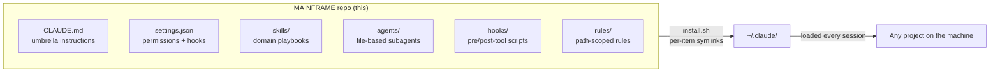
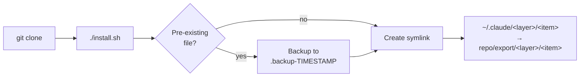
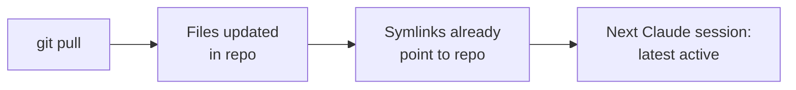
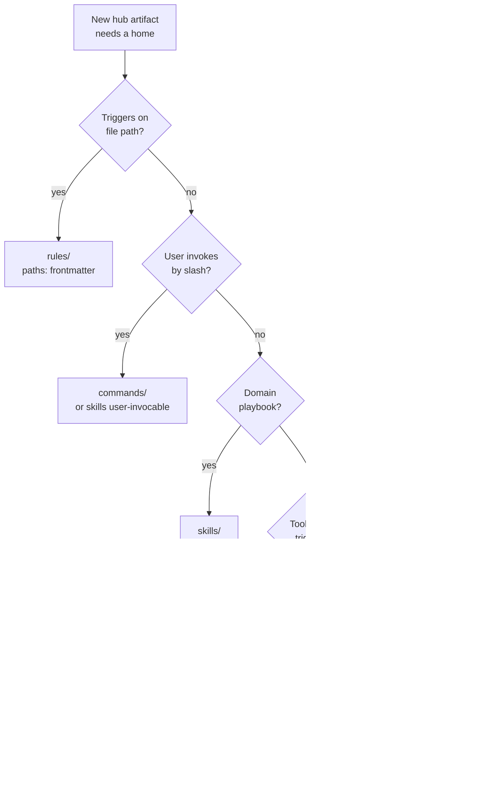

<p align="center">
  
</p>

# MAINFRAME

[](LICENSE)
[](https://code.claude.com)
[]()
[](#principles)

 Maintained by [@CATWILLgh](https://github.com/CATWILLgh)

A baseline of operating rules, focused sub-agents, and small automatic checks I want to apply in **every** Claude Code session on my machine. Set up once — every project, every session, inherits the same discipline.

> **Personal-use.** No support, no compatibility guarantees, no backwards-compatibility promises. Forks are welcome under MIT, but this hub is shaped to one engineer's workflow.

<p align="center">
  
</p>

## Why this exists

Working with Claude Code (or any AI coding agent) on multiple projects, you keep running into the same friction:

- **Same baseline, every time.** You re-deploy the same useful sub-agents, the same operating rules, the same little safety checks for every new project. Manually. Forever.
- **Project-level config doesn't scale.** Putting it all into the project's own `CLAUDE.md` works — until that file grows. Then attention scatters, the well-known **lost-in-the-middle** problem kicks in, and important rules quietly stop being followed mid-session.
- **The agent itself bloats its own config.** Left to its habits, Claude keeps appending new instructions to `CLAUDE.md`. The file grows, focus thins, the rules crumble. And so it grows, slowly, until you notice the discipline you started with is gone.

This repo is my attempt to do that baseline layer **separately** from any specific project, with deliberate size limits and small reminders so things don't drift:

- Strict file-size budgets on skills, agents, hooks. A file gets too big — a hook nudges me.
- Skills and agents stay granular and narrowly focused — at any moment, only the most relevant context is loaded, not a soup of "a little bit of everything".
- Constantly iterating: try a new approach, see what stabilizes Claude's behavior, keep what works, drop what doesn't.
- Every decision cross-checked against authoritative sources (Anthropic docs, RFCs, well-known engineering material) — not "feels right".

**Honest disclaimer.** I'm not claiming this hub closes every pain. Some friction with AI agents is just current-generation model limits — the best a hub can do is smooth them, not fix them. What I am aiming for: a higher minimum quality of output code by default. On long-running development that pays back many times over — problems caught and prevented up front instead of bugs to chase later, by you or by the agent.

<p align="center">
  
</p>

## What you actually get

In plain words — what each piece is for:

- **Umbrella `CLAUDE.md`** — a tight set of working rules Claude follows in every project on your machine. Partnership-mode, honest pushback when I'm wrong, no flattery, source-checking before non-trivial decisions, atomic commits, no leftover `TODO`/`FIXME` markers, and so on. About 200 lines, intentionally short to stay in focus.
- **Skills** — small focused playbooks Claude pulls when they're relevant. Things like "audit this code carefully", "format this commit message in Conventional Commits style", "scan this diff for forgotten secrets" — instead of one giant document trying to cover everything.
- **Agents (sub-agents)** — pre-configured specialists with their own model and effort level wired in. Backend engineers for Python and Node.js, a frontend engineer for React, a web-search agent for authoritative source-checking. You don't have to remember which model to pick for what — the right one is already attached.
- **Hooks** — small automatic checks that run on tool events. Catch leftover `TODO`/`FIXME` markers before commit. Warn on risky bash patterns. Scan diffs for security issues with `ruff`/`semgrep`/`osv-scanner`. Things that fire without you having to remember to fire them.
- **Rules** — small path-scoped guidance files that load on demand when Claude reads a matching path. Doesn't bloat the global context.
- **Permissions** — three-tier model (deny / ask / allow) that's strict by default. Some things must never run; some need confirmation; the rest run quietly with logging.

End result the hub aims for: **the same baseline of quality and discipline applied to every project on your machine — without re-configuring Claude each time or babysitting it during a session.** When the baseline is high, day-to-day output is more predictable and bug rate drops.

<p align="center">
  
</p>

## Architecture



Each artifact type lives in its own layer with a specified contract. See [`docs/layers/`](docs/layers/) for full layer specifications.

<p align="center">
  
</p>

## Install

```bash
git clone https://github.com/CATWILLgh/MAINFRAME ~/Documents/projects/MAINFRAME
cd ~/Documents/projects/MAINFRAME
./install.sh
```



What `install.sh` does:

- **Per-item symlinks** from `export/{skills,hooks,rules,agents,commands,output-styles}/*` into matching directories under `~/.claude/`. Composes with any existing user-created skills/hooks/rules — does NOT replace the whole directory.
- **Backs up** any pre-existing real file before replacing with a symlink.
- **Idempotent** — re-running is a no-op when state matches.
- **Drift cleanup** — removes managed symlinks whose source disappeared since the last run.

Options:

```
./install.sh              # install (with backups)
./install.sh --dry-run    # preview, no changes
./install.sh --uninstall  # remove managed symlinks
./install.sh --help
```

<p align="center">
  
</p>

## Update

```bash
cd ~/Documents/projects/MAINFRAME
git pull
```

That's it. Symlinks point to files in this repo — the next Claude Code session sees the latest. Re-run `install.sh` **only** if a new top-level directory appeared under `export/`.



<p align="center">
  
</p>

## Tested configuration

What I have actually verified this hub on:

- **Claude Code CLI** — the primary surface I use daily.
- **Claude Code IDE extension** — also in active use.
- **Main thread model**: Claude **Opus 4.7+** at `high` or `xhigh` effort. This is what I run every day and what all the discipline is tuned against.
- **Sub-agents** — each one calibrated separately via a small empirical tournament so the right model + effort sits inside the agent file itself. You don't have to think about it at call time.

Other model / effort combinations may work but I haven't verified them. When an agent's prompt body changes in a meaningful way, I re-run its tournament.

**Trying the hub on other models or effort levels is very welcome** — Sonnet, Haiku, lower or higher effort, different IDEs. Share what you observe (open an issue or a PR with notes); empirical results on configurations I don't run daily are exactly the kind of feedback the hub gets better from.

**OpenAI Codex** support is in the future-list, not in scope yet.

<p align="center">
  
</p>

## Platforms

- **macOS** — primary, tested daily.
- **Linux** — should work; `install.sh` is plain Bash 3.2+ compatible, no macOS-specific paths.
- **Windows** — not supported yet, no timeline for it.

<p align="center">
  
</p>

## What's inside

| Path | Purpose |
|------|---------|
| [`export/CLAUDE.md`](export/CLAUDE.md) | Umbrella operating instructions — loaded into every Claude Code session globally |
| [`export/settings.json`](export/settings.json) | Permission rules (allow/ask/deny) + hook registration |
| [`export/skills/`](export/skills/) | Claude Code skills — domain playbooks (code audit, secrets, testing strategy, stack-specific backend/frontend patterns, etc.) |
| [`export/agents/`](export/agents/) | File-based subagents: `react-frontend-engineer`, `python-backend-engineer`, `nestjs-backend-engineer`, `web-search` |
| [`export/hooks/`](export/hooks/) | Pre/post-tool-use Python scripts for live validation and safety (security scans, suppression-marker detection, comment discipline) |
| [`export/rules/`](export/rules/) | Path-scoped rule files loaded on-demand via `paths:` frontmatter |
| [`export/commands/`](export/commands/) | Slash commands |
| [`export/output-styles/`](export/output-styles/) | Output style overrides |
| [`tools/`](tools/) | Python validators for `CLAUDE.md` and `SKILL.md` (run by hooks, also runnable manually) |
| [`docs/layers/`](docs/layers/) | Architecture specs per layer |

<p align="center">
  
</p>

## Layer architecture

Each artifact type has its own layer with explicit contract: where it lives, what frontmatter it carries, what limits apply, when it activates. New artifacts go through a decision tree to land in the correct layer.



| Layer | Spec |
|---|---|
| Umbrella `CLAUDE.md` | [`docs/layers/claude-md.md`](docs/layers/claude-md.md) |
| Skills | [`docs/layers/skills.md`](docs/layers/skills.md) |
| Agents | [`docs/layers/agents.md`](docs/layers/agents.md) |
| Hooks | [`docs/layers/hooks.md`](docs/layers/hooks.md) |
| Rules | [`docs/layers/rules.md`](docs/layers/rules.md) |
| Commands | [`docs/layers/commands.md`](docs/layers/commands.md) |
| Permissions | [`docs/layers/permissions.md`](docs/layers/permissions.md) |
| Settings | [`docs/layers/settings.md`](docs/layers/settings.md) |
| Output styles | [`docs/layers/output-styles.md`](docs/layers/output-styles.md) |
| Decision tree | [`docs/layers/decision-tree.md`](docs/layers/decision-tree.md) |

<p align="center">
  
</p>

## Principles

Every artifact in `export/` holds these:

1. **Project-agnostic** — no hardcoded project names, stacks, paths, or domains.
2. **Evidence-based** — new rules need real experience, an authoritative source, or a measured experiment. Not "feels right".
3. **English in artifacts** — skills, agents, commands, hooks all in English (LLM adherence).
4. **Single source of truth** — each artifact exists in exactly one location in `export/`.
5. **Sub-agent economy** — pick the right model per task (Haiku for trivial, Sonnet for most research, Opus only for genuine reasoning needs).

<p align="center">
  
</p>

## Contributing

This is a personal hub but friends, acquaintances, and curious strangers are welcome to fork, adapt, and share what works. The repo gets better when more people poke at it from different angles — new approaches, sharper rules, things I haven't tried.

See [CONTRIBUTING.md](CONTRIBUTING.md) for fork conventions, principles, validators, and commit format.

<p align="center">
  
</p>

## License

[MIT](LICENSE) — use, fork, modify freely, no warranty.
