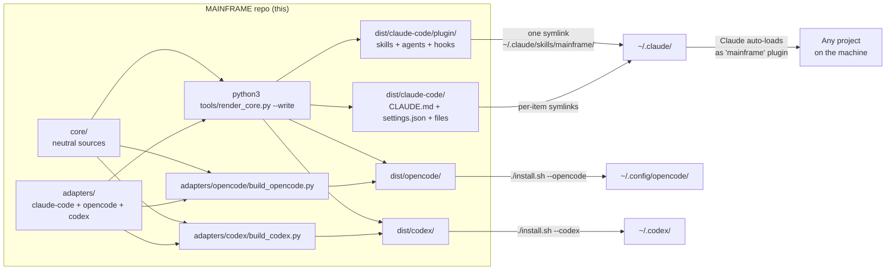
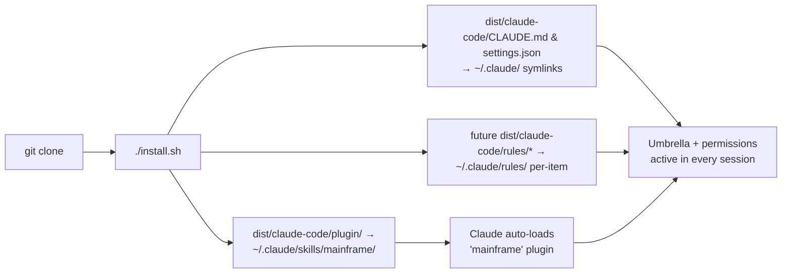
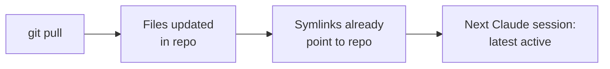
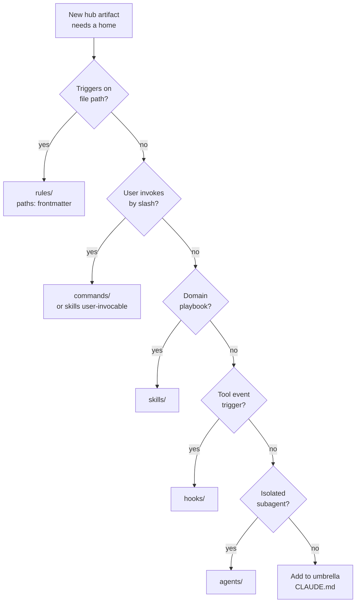

<p align="center">
  
</p>

# MAINFRAME

[](https://github.com/CATWILLgh/MAINFRAME/actions/workflows/ci.yml)
[](LICENSE)
[](https://code.claude.com)
[]()
[](#platforms)
[](#tested-configuration)
[](https://github.com/CATWILLgh/MAINFRAME/commits)
[](dist/claude-code/plugin/skills)
[](dist/claude-code/plugin/agents)
[](dist/claude-code/plugin/hooks/scripts)
[](#principles)

 Maintained by [@CATWILLgh](https://github.com/CATWILLgh)

A machine-wide baseline of operating rules, focused sub-agents, and small automatic checks for **every** Claude Code, OpenCode, and Codex session.

It's shaped for long **auto-mode** runs: Claude and I plan a larger feature up front, then it executes unattended for hours or sometimes days. Every rule, hook, and permission tier is built to hold quality when no one is watching each step and a missed check can become a bug nobody catches until later.

## Engineering at a glance

For the technically curious — the concrete engineering this repo demonstrates, not the motivation behind it:

- **Fail-open hooks.** Every check exits cleanly when its tool is missing or it errors, so the hook layer degrades to silence rather than stalling a session.
- **A git-level secret gate.** High-confidence credentials are blocked before they reach history; the hook and trigger are detailed below.
- **Size budgets against lost-in-the-middle.** Skills, agents, and hooks are capped at ≤5K tokens — a limit calibrated to the runtime's compaction behaviour so the content survives a context compaction intact instead of being truncated.
- **Covered by tests and CI.** Hundreds of Python tests run on every push (the CI badge above) alongside the format/size validators; the shipped hooks have zero third-party Python runtime dependencies.

> **Personal-use.** No support, no compatibility guarantees, no backwards-compatibility promises. Forks are welcome under MIT, but this hub is shaped to one engineer's workflow.

<p align="center">
  
</p>

## Why this exists

Working with Claude Code (or any AI coding agent) on multiple projects, you keep running into the same friction:

- **Same baseline, every time.** You re-deploy the same useful sub-agents, the same operating rules, the same little safety checks for every new project. Manually. Forever.
- **Project-level config doesn't scale.** Putting it all into the project's own `CLAUDE.md` works until the file grows and the well-known **lost-in-the-middle** problem scatters attention. Claude's habit of appending more instructions accelerates that bloat until important rules quietly stop being followed mid-session and the original discipline is gone.

This repo moves that baseline **outside** any specific project and keeps it bounded. A hook nudges when a skill, agent, or hook exceeds its size budget; granular, narrowly focused skills and agents load only the relevant context instead of a soup of "a little bit of everything". The process that decides what stays or goes is described next.

**Honest disclaimer.** This hub cannot close every pain; some friction is a current-generation model limit that structure can only smooth, not fix. The aim is a higher minimum quality by default: more predictable day-to-day output and problems caught up front instead of bugs for you or the agent to chase later. That pays back many times over on long-running development.

<p align="center">
  
</p>

## Where this comes from

This isn't a weekend project or a copied template. It's distilled from thousands of hours with AI coding agents and recurring patterns on real projects — what consistently helped, what quietly broke, what was worth keeping. Every rule earned its place by surviving use, not theory.

Two other inputs keep that experience honest:

- **Authoritative sources.** I don't ship a rule on a hunch. Each non-trivial decision is checked against primary sources — Anthropic's own docs, RFCs, established engineering material — and validated with a small experiment where I can.
- **Constant feedback.** I work on this almost every day, together with the agent. When something underperforms in real use, it gets refined or dropped. The hub is never "finished" — it's continuously corrected against what actually happens.

It looks like a folder of Markdown files — some skills, a few agents — but steering a language model reliably across many projects and the long autonomous runs described above is one of the genuinely hard parts of agentic systems. The model's inference — how it generates each step — is a kind of *ordered chaos*: powerful, but hard to keep pointed in the right direction at scale. This hub puts just enough structure around that chaos to make the output dependable without strangling what the model is good at.

<p align="center">
  
</p>

## What you actually get

In plain words — what each piece is for:

- **Umbrella instructions** — one shared set of working rules, rendered as `CLAUDE.md` for Claude Code and `AGENTS.md` for OpenCode and Codex. Partnership-mode, honest pushback when I'm wrong, no flattery, source-checking before non-trivial decisions, atomic commits, no leftover `TODO`/`FIXME` markers, and so on. The tool-specific wrappers stay thin so the shared rules remain the owner.
- **Skills** — small focused playbooks Claude pulls when they're relevant. Things like "audit this code carefully", "format this commit message in Conventional Commits style", "scan this diff for forgotten secrets" — instead of one giant document trying to cover everything.
- **Agents (sub-agents)** — neutral specialist contracts with capability and reasoning tiers that each adapter translates into its runtime's agent controls. Backend engineers for Python, Node.js, and Next.js (App Router server layer), a frontend engineer for React, a devops engineer for deploys and infra, a decision-reviewer for high-stakes design calls, and a web-search agent for authoritative source-checking.
- **Hooks** — shared automatic checks with runtime-specific wiring. They catch leftover `TODO`/`FIXME` markers, warn on risky shell patterns, scan diffs for security issues, and gate unresolved problems where the runtime supports it. Claude Code carries the full set; OpenCode and Codex receive documented subsets.
- **Rules** — a reserved Claude Code layer for small path-scoped guidance files that load on demand when Claude reads a matching path. It is currently empty.
- **Permissions** — one neutral policy source projected into each runtime's available controls. Claude Code receives the full deny / ask / allow lists; OpenCode and Codex receive conservative, explicitly limited projections.

<p align="center">
  
</p>

## Inventory — what's actually inside

Below are the shared **agents**, **hooks**, and **skills** in the Claude Code target. OpenCode and Codex receive the projections summarized in [Architecture](#architecture).

### Agents — 7 specialist sub-agents

The neutral contracts carry capability and reasoning tiers; each adapter maps them to its runtime. In Claude Code they are invoked as `subagent_type: "mainframe:<name>"` and use the model shown below.

| Agent | What it's for | Model |
|---|---|---|
| `python-backend-engineer` | Python backend work — FastAPI / Django / Flask endpoints, ORM models, auth, background workers | Sonnet |
| `nestjs-backend-engineer` | Node.js / NestJS backend — endpoints, ORM, auth, WebSocket gateways, queue workers | Sonnet |
| `nextjs-backend-engineer` | Next.js App Router server layer — route handlers, server actions, RSC data, caching, auth | Sonnet |
| `react-frontend-engineer` | React + Vite frontend — pages, components, forms, data fetching, API integration | Sonnet |
| `devops-engineer` | Deploys, CI/CD, containers, infra config, managed databases, Dokploy | Opus |
| `decision-reviewer` | Adversarial, evidence-grounded second look at a high-stakes design or approach before you commit | Opus |
| `web-search` | Authoritative source lookup — Context7 docs + live web, returns cited quotes | Sonnet (low) |

### Hooks — what each one checks, and when

Hooks fire on tool-lifecycle events. Two kinds: a **gate** can block or ask (it stops the action or the turn until something is fixed); an **advisory** only injects a note and never blocks. The core design is **warn early, block at the end** — when you edit a file the advisory scanners flag a problem immediately, and if it's still unresolved when Claude tries to finish, the matching **Stop-gate** blocks the finish. So a real issue can't quietly slip through to the end of an unattended run. The fail-open behavior summarized above applies to every hook.

#### At session start — `SessionStart` (fresh start, resume, `/clear`, and after every compaction)

- **`session-posture.py`** — Injects the hub working posture as context: engage the process instead of reasoning past it, work in two phases (plan with the user, then execute autonomously), surface out-of-scope findings as tickets, and delegate broad work to sub-agents. A salient reminder at the moment context is fresh, since a steady `CLAUDE.md` line fades into the background.
- **`task-workflow-engagement.py`** (reset half) — Resets a per-segment marker tracking whether the `task-workflow` process skill was actively invoked. Its enforcement half fires before your first edit — see below. This reset on every session start (including after a compaction) is what makes it re-fire post-compaction.
- **`hooklib-smoke-check.py`** — Self-test that the shared hook library imports cleanly. Every other hook silently no-ops if that library is broken, so this one announces the failure loudly at session start instead of letting the whole hook layer go dark unnoticed.

#### Before a Bash command — `PreToolUse` on Bash

- **`secret-commit-gate.py`** — *Gate (blocks).* When the command is a `git commit`, scans the staged diff for high-confidence secret shapes (vendor API tokens, private keys) and blocks the commit if one is staged. Skips repos that use SOPS or git-crypt; defers on any error rather than risk a false block.
- **`path-validation.py`** — *Gate (asks).* Parses a recursive `rm -rf`, resolves every target path, and allows it silently when all targets are inside the project — but asks for confirmation if any path is outside the project, unresolved, or built from a subshell. Anything that isn't a recursive `rm` passes straight through.
- **`bash-pattern-reminder.py`** — *Advisory.* Catches commands that historically trigger auto-mode permission prompts or stall a hands-off run (literal `rm -rf`, heredoc/redirect into `/tmp`, ad-hoc global installs) and suggests the friction-free alternative (the Write tool, the installer's helper). Non-blocking on purpose — a block would become a freeze in auto-mode.
- **`commit-conventional-reminder.py`** — *Advisory.* On a `git commit`, reminds about Conventional Commits grammar (type / scope / subject).

#### Before you load a skill, or edit a file — `PreToolUse` on Skill / Edit / Write

- **`task-workflow-engagement.py`** (enforcement half) — *Advisory.* When the `task-workflow` skill is invoked it marks the segment active; on your first file-modifying call (Edit / Write / MultiEdit) of a segment where it wasn't, it nudges the main agent to invoke `task-workflow` first. A skill survives a compaction (its first 5K tokens get re-attached) but the runtime frames the copy "context only" and the model deprioritises it — so the process can be present yet not actually followed. Fires once per segment, main agent only (sub-agents can't invoke skills).

#### Right after you edit a file — `PostToolUse` on Edit / Write / MultiEdit (all advisory — the "warn early" half)

- **`scan-suppression-markers.py`** — Flags suppression markers (`TODO` / `FIXME` / `HACK`, skipped or focused tests, `@ts-ignore` / `eslint-disable` / `# noqa`) and debug residue (`debugger`, `breakpoint()`, `console.debug`, `var_dump` / `dd`) that the edit just introduced. Diff-aware: it flags only what the change added, not what was already there.
- **`comment-discipline-reminder.py`** — Flags comments the edit just added that match a banned form — process narration, redundant paraphrase of the code, position / phase markers, journal / byline notes. The "comment the WHY, not the WHAT" rule, surfaced at write time.
- **`ticket-id-format-reminder.py`** — On a new `docs/tickets/<id>-*.md` whose id is a short sequential number (`NNN`), nudges to use a random 8-hex id instead (`openssl rand -hex 4`). Sequential ids collide when several branches or agents each allocate "the next number" independently; random ones don't. Write-only, so editing a legacy `NNN` ticket doesn't nag.
- **`python-security-scan.py`** — Runs Ruff's curated S (flake8-bandit, OWASP-aligned) + B (flake8-bugbear) rules over the changed Python and notes high-confidence dangerous patterns and correctness bugs — `pickle.load`, unsafe `yaml.load`, `subprocess(..., shell=True)`, and similar.
- **`python-deps-audit.py`** — When a Python dependency file changes, runs `pip-audit` and notes known CVEs in the dependency tree.
- **`nodejs-security-scan.py`** — Runs oxlint's curated dangerous-pattern subset over the changed JS / TS — classic RCE (`eval`, `new Function`), unsafe React, and more — and notes the hits.
- **`nodejs-deps-audit.py`** — When a Node dependency file changes, runs `osv-scanner` and notes known CVEs.

#### Before the turn ends — `Stop` (the final gates, plus a few advisory notes)

- **`stop-gate-suppression-markers.py`** — *Gate (blocks).* Blocks the turn from finishing while suppression markers or debug residue added this session remain unresolved — the hard backstop to the advisory scanner above.
- **`stop-gate-comment-discipline.py`** — *Gate (blocks).* Blocks finishing while banned narration comments (measured against `git HEAD`) remain.
- **`python-security-stop-gate.py`** — *Gate (blocks).* Blocks finishing while unresolved Ruff security findings remain in changed Python.
- **`nodejs-security-stop-gate.py`** — *Gate (blocks).* Blocks finishing while unresolved Semgrep security findings remain in changed JS / TS (using the YAML rules under `hooks/rules/`).
- **`frontend-fsd-gate.py`** — *Gate (blocks).* Blocks finishing on Feature-Sliced-Design import-direction violations (a lower layer importing an upper one), via dependency-cruiser.
- **`frontend-dead-code.py`** — *Advisory.* Notes dead / unused files via Knip. Opt-in per project.
- **`fallow-quality-note.py`** — *Advisory.* Notes quality smells in changed TS / JS — import cycles, layer-boundary breaks, dead files, over-complexity, copy-paste — via the `fallow` analyzer. Throttled, conservative categories only.
- **`memory-reminder.py`** — *Advisory.* A gentle nudge to save a durable cross-session fact to Claude's native auto-memory after a substantive session. Throttled (~30 min), skips trivial sessions, and is framed so "nothing worth saving" is a fine answer.

#### Always-on, and the plumbing

- **`telemetry.py`** — *(dev-only.)* Fires across many events — session start/end, skill loads, file edits, todo-list updates, permission denials, sub-agent starts — and logs local-only event metadata (counts and coarse buckets, never prompts, code, todo text, or file paths) into a local SQLite DB. Present only when the `--dev` instrumentation is installed; on a plain install it isn't wired and writes nothing.
- **Shared libraries** (not hooks themselves): `_hooklib.py` — common scaffolding (payload parsing, the emit / gate helpers, git diffing); `_markers.py` — the suppression-marker and debug-residue detector sets; `comment_extract.py` — false-positive-free comment / docstring extraction.

### Skills — 18 focused playbooks

In Claude Code, pulled automatically when the situation matches or invoked as `/mainframe:<name>`. OpenCode and Codex use their native skill-loading mechanisms.

| Group | Skills |
|---|---|
| **Process & quality** | `task-workflow` (the universal task cycle), `surface-ticket` (file deferred problems as tickets), `no-suppression-markers` (completion gate), `testing-strategy` (which test tier + level), `severity-calibration` (rank findings honestly), `code-audit` (parallel multi-aspect review), `decision-review` (validate an approach), `git-conventional-commits` (commit message grammar) |
| **Backend** | `python-backend-patterns`, `nestjs-backend-patterns`, `nextjs-backend-patterns` — stack recon + ORM / validation / auth / observability patterns |
| **Frontend** | `react-frontend-patterns` (FSD, state, data fetching), `frontend-design` (colour, type, a11y, motion, layout), `shadcn` (shadcn/ui composition) |
| **Ops & misc** | `ops-app-server-safety` (no duplicate servers, safe stops), `dokploy-api` (Dokploy PaaS HTTP API), `curl-requests` (HTTP request templates), `secrets-handling` (credentials layout + pre-reply secret scan) |

<p align="center">
  
</p>

## Architecture



The hub is tool-agnostic at its core: shared artifacts live in `core/`, and thin tool refinements live in `adapters/{claude-code,opencode,codex}/`. `python3 tools/render_core.py --write` renders the Claude Code artifacts and composes the umbrella instructions for all three tools. The installer also runs `adapters/opencode/build_opencode.py` and `adapters/codex/build_codex.py` for their native projections.

Edit source files, not generated delivery files. Two narrowly defined cases live in `dist/`: future path-scoped Claude Code rules are authored directly in `dist/claude-code/rules/` because no `core/rules/` mapping exists, and the non-permission fields in `dist/claude-code/settings.json` remain user-owned while the renderer key-merges only `permissions.{allow,deny,ask}`. CI checks the mappings owned by `render_core.py` with `python3 tools/render_core.py --check`.

The direct-owned plugin manifest and committed golden fixtures also live under `dist/`, but they are delivery metadata and tests rather than artifact layers.

The Claude Code target ships in two channels:

- **A plugin** (`dist/claude-code/plugin/`) carries skills, agents, and hooks. After install, Claude Code auto-loads it as the `mainframe` plugin via the skills-dir mechanism, and everything inside becomes available with the `mainframe:` namespace prefix (e.g. `/mainframe:code-audit`, `subagent_type: "mainframe:python-backend-engineer"`). That namespace is the visible mark that something is coming from this hub, not from your local project setup or another plugin.
- **Single-file and per-item symlinks** (`dist/claude-code/`) carry the umbrella `CLAUDE.md`, the hybrid `settings.json`, output styles, and a small credentials helper. The installer is also prepared to link direct-authored path-scoped rules if that currently empty layer gains files.

OpenCode uses its composed instructions and generated agents under `dist/opencode/`, plus the direct adapter plugin and shared Claude-rendered skills. Codex uses generated native artifacts under `dist/codex/`. The installer delivers them into `~/.config/opencode/` and `${CODEX_HOME:-~/.codex}` respectively. OpenCode agents and most Codex projections are gitignored build output; committed goldens test representative transformations.

See [`docs/layers/`](docs/layers/) for full per-layer specifications.

<p align="center">
  
</p>

## Requirements

**Required:**

- **The target runtime** — Claude Code v2.1+ for the default install, OpenCode for `--opencode`, or Codex for `--codex`. The OpenCode and Codex flags are additive to the Claude Code baseline.
- **git** — to clone the repo, and for the hooks that diff your working tree.
- **Bash 3.2+** — to run `install.sh` (macOS system Bash is fine; no GNU-only extensions used).
- **Python 3** — every shipped hook is stdlib Python 3 (they shell out to the linters below, but need no Python packages of their own). Without Python 3 they silently no-op (the installer warns; it does not fail).
- **The repository `.venv` for alternate targets** — OpenCode and Codex projections require PyYAML. Bootstrap once with `python3 -m venv .venv && .venv/bin/pip install tiktoken pyyaml`.

**Recommended — each unlocks a group of checks; anything missing just stays silent, and `install.sh` prints an OS-specific install hint:**

- **Node.js / npm** — the React and Node.js agents, the shadcn CLI (`npx`), the frontend recon script, and the JS hooks (`oxlint`, `dependency-cruiser`, `knip`, `fallow`). `install.sh` installs the four hook tools as npm globals for you.
- **uv or pipx** — installs the Python-packaged linters the hooks call: `ruff`, `semgrep`, `pip-audit` (`semgrep` powers the JS/TS security stop-gate, but installs as a Python package).
- **osv-scanner** — the dependency-vulnerability hook (`install.sh` can fetch the binary for you).

A missing optional scanner disables only the check that depends on it; the installer reports what is unavailable. Run `./install.sh --dry-run` to preview everything and see exactly what's missing.

<p align="center">
  
</p>

## Install

```bash
git clone https://github.com/CATWILLgh/MAINFRAME ~/Documents/projects/MAINFRAME
cd ~/Documents/projects/MAINFRAME
./install.sh
```

Use an additive target flag for OpenCode or Codex; each command also installs the Claude Code baseline:

```bash
./install.sh --opencode
./install.sh --codex
```



What `install.sh` does:

- **One symlink for the plugin** — `dist/claude-code/plugin/` becomes `~/.claude/skills/mainframe/`. Claude Code auto-loads it and prefixes everything inside with the `mainframe:` namespace.
- **Single-file symlinks** for the umbrella `CLAUDE.md` and the permission `settings.json` (the plugin format does not provide an equivalent for these).
- **Per-item rule symlinks when present** — the Rules layer is currently empty; once a direct-authored file exists under `dist/claude-code/rules/`, it is linked into `~/.claude/rules/` without replacing the whole directory.
- **Credentials helper** — links `dist/claude-code/scripts/secret` into `~/.local/bin/` and seeds `~/.config/credentials/` + `~/.claude/credentials-index.md` from the template.
- **OpenCode target** — `--opencode` installs `AGENTS.md`, projected agents, shared skills, and the adapter-owned `mainframe-gates.js` plugin into `~/.config/opencode/`; it also merges the hub permission map and compatible secret-free MCP entries into `opencode.json`. Its permission mapping and turn-end enforcement are thinner than Claude Code's.
- **Codex target** — `--codex` installs `AGENTS.md`, projected skills, `mainframe.rules`, gate hooks, and agents into `${CODEX_HOME:-~/.codex}`. Hook gates require one-time per-project trust through `/hooks`, renewed after gate changes, and reuse detectors from the base Claude Code plugin install.
- **Stale-symlink cleanup** — on first run after upgrading from the older per-item layout, removes leftover hub symlinks under `~/.claude/{skills,agents,hooks}/`.
- **Backs up** any pre-existing real file before replacing it with a symlink.
- **Idempotent** — re-running is a no-op when state matches.

Options:

```
./install.sh              # install (with backups)
./install.sh --opencode   # install the OpenCode target
./install.sh --codex      # install the Codex target
./install.sh --dev        # install + hub-development instrumentation (see below)
./install.sh --dry-run    # preview, no changes
./install.sh --uninstall  # remove managed symlinks (incl. --dev ones)
./install.sh --help
```

**`--dev` — hub-development instrumentation (most users don't need this).** A plain install ships none of it. The flag adds three opt-in pieces, all strictly local; their data lives inside the repo at `workspace/runtime/` (gitignored), reached via the hub-owned symlink `~/.claude/mainframe`:

- **`harness-feedback` skill** (`dev/skills/`) — agents file structured friction reports about the hub's own rules/hooks into `~/.claude/mainframe/feedback/` for later triage. Without the skill installed, the related nudges in hook output stay silent.
- **Usage telemetry** — hooks log event metadata (no prompts, no code, no paths) into a local SQLite DB under `~/.claude/mainframe/telemetry/`, and only while that hub-owned namespace exists. Nothing is ever sent anywhere. Remove the symlink to stop logging.
- **Local hub map** — a self-contained `workspace/runtime/hub.html` page. A searchable catalog of every skill, agent, and hook — click any card, or any graph node, for its details and what references it; the hook trigger matrix; a **Config** panel showing the permission tiers and key settings; a **Health** panel that surfaces broken cross-references, orphaned skills, and missing hook scripts; a telemetry panel broken down by agent, by day, and by miss type; and a relationship graph. Generated on `--dev` install; regenerate any time with `.venv/bin/python3 tools/build_hub_page.py`. Open it straight from disk (no server) — it reads nothing remote.

To temporarily disable the plugin without uninstalling, use `claude plugin disable mainframe` (and `claude plugin enable mainframe` to re-enable).

<p align="center">
  
</p>

## Update

```bash
cd ~/Documents/projects/MAINFRAME
git pull
```

Existing file symlinks see pulled changes immediately. Re-run `./install.sh` when the Claude Code delivery tree gains a newly linked item; re-run `./install.sh --opencode` or `./install.sh --codex` after changes to those projections so their generators, per-item links, and runtime configuration are refreshed.



<p align="center">
  
</p>

## Tested configuration

What I have actually verified this hub on:

- **Claude Code CLI** — the primary surface I use daily.
- **Claude Code IDE extension** — also in active use.
- **OpenCode** — supported through the `--opencode` projection and installer path.
- **OpenAI Codex** — supported through the `--codex` projection and installer path.
- **Main thread model**: Claude **Opus 4.7+** at `high` or `xhigh` effort (currently **Opus 4.8** day to day). This is what I run every day and what all the discipline is tuned against.
- **Sub-agents** — each one calibrated separately via a small empirical tournament so the right model + effort sits inside the agent file itself. You don't have to think about it at call time.

Other model / effort combinations may work but I haven't verified them. When an agent's prompt body changes in a meaningful way, I re-run its tournament.

**Trying the hub on other models or effort levels is very welcome** — Sonnet, Haiku, lower or higher effort, different IDEs. Share what you observe (open an issue or a PR with notes); empirical results on configurations I don't run daily are exactly the kind of feedback the hub gets better from.

<p align="center">
  
</p>

## Platforms

- **macOS** — primary, tested daily.
- **Linux** — should work; `install.sh` is plain Bash 3.2+ compatible, no macOS-specific paths.
- **Windows** — not supported yet, no timeline for it.

<p align="center">
  
</p>

## Directory map

```
MAINFRAME/
├── README.md, LICENSE, CONTRIBUTING.md   # project meta
├── install.sh                            # installer for Claude Code plus optional OpenCode/Codex targets
├── assets/                               # README images (banner, divider, badge)
│
├── core/                                  # TOOL-NEUTRAL SOURCES (source of truth)
│   ├── agents/                            # neutral agent capability contracts
│   ├── gates/                             # neutral gate detectors and data
│   ├── instructions/                      # shared umbrella instruction fragments
│   ├── permissions/rules.json             # hub-owned permission rules
│   └── skills/                            # shared skills and supporting files
│
├── adapters/                              # PER-TOOL SOURCE REFINEMENTS
│   ├── claude-code/                       # Claude Code refinements + hand-authored files
│   │   └── files/                         # output-styles, scripts, and templates
│   ├── opencode/                          # OpenCode refinements and projection generator
│   └── codex/                             # Codex refinements and projection generator
│
├── dist/                                  # delivery output; generated except documented direct-owned files
│   ├── claude-code/
│   │   ├── plugin/                       # installed as the 'mainframe' plugin
│   │   │   ├── .claude-plugin/plugin.json # plugin manifest
│   │   │   ├── skills/                   # rendered from core/skills/
│   │   │   ├── agents/                   # rendered from core/agents/
│   │   │   └── hooks/                    # rendered detectors, rules, launcher, and registration
│   │   ├── CLAUDE.md                     # composed umbrella instructions
│   │   ├── settings.json                 # rendered permission lists + user-owned settings
│   │   ├── output-styles/                # rendered Claude Code styles
│   │   ├── scripts/secret                # rendered credentials helper
│   │   └── templates/credentials-index.md # rendered starter template
│
│   ├── opencode/                         # OpenCode render output
│   │   ├── AGENTS.md                     # OpenCode umbrella instructions
│   │   ├── agents-golden/                # golden agent projections
│   │   └── agents/                       # generated projected agents (gitignored)
│
│   └── codex/                            # Codex render output
│       ├── AGENTS.md                     # Codex umbrella instructions
│       ├── skills-golden/                # committed representative projection fixtures
│       ├── skills/                       # generated skills (gitignored)
│       ├── rules/mainframe.rules         # permission rules
│       ├── hooks.json                    # gate hook configuration
│       ├── mainframe-hook.sh             # gate hook dispatcher
│       └── agents/<name>.toml            # projected agent definitions
│
├── tools/                                # Python validators (used by hooks; runnable manually)
│   ├── validate-claude-md.py             # umbrella spec + project-agnosticism check
│   ├── validate-skill.py                 # skill format + size limits
│   └── agnostic-blacklist.txt.example    # copy to agnostic-blacklist.txt and add your own project names
│
└── docs/
    └── layers/                           # architecture spec per layer (skills, agents, hooks, rules, ...)
```

Internal ADRs, maintainer working notes, the inbox of unprocessed candidates, runtime telemetry, and per-machine memory are gitignored. The published artifact is the hub plus the contributor-facing layer specifications under `docs/layers/`.

<p align="center">
  
</p>

## Layer architecture

Each artifact type has its own layer with explicit contract: where it lives, what frontmatter it carries, what limits apply, when it activates. New artifacts go through a decision tree to land in the correct layer.



| Layer | Spec |
|---|---|
| Umbrella instructions (`CLAUDE.md` / `AGENTS.md`) | [`docs/layers/claude-md.md`](docs/layers/claude-md.md) |
| Skills | [`docs/layers/skills.md`](docs/layers/skills.md) |
| Agents | [`docs/layers/agents.md`](docs/layers/agents.md) |
| Hooks | [`docs/layers/hooks.md`](docs/layers/hooks.md) |
| Rules | [`docs/layers/rules.md`](docs/layers/rules.md) |
| Commands | [`docs/layers/commands.md`](docs/layers/commands.md) |
| Permissions | [`docs/layers/permissions.md`](docs/layers/permissions.md) |
| Settings | [`docs/layers/settings.md`](docs/layers/settings.md) |
| Output styles | [`docs/layers/output-styles.md`](docs/layers/output-styles.md) |
| Decision tree | [`docs/layers/decision-tree.md`](docs/layers/decision-tree.md) |

<p align="center">
  
</p>

## Principles

Every artifact shipped by this hub holds these:

1. **Project-agnostic** — no hardcoded project names, stacks, paths, or domains.
2. **Evidence-based** — real experience, an authoritative source, or a measured experiment behind each new rule; never "feels right".
3. **English in artifacts** — skills, agents, commands, hooks all in English (LLM adherence).
4. **Single source of truth** — each artifact exists in exactly one location in the repo.
5. **Sub-agent economy** — pick the right model per task (Haiku for trivial, Sonnet for most research, Opus only for genuine reasoning needs).

<p align="center">
  
</p>

## A personal note

I'm not a scientist or a credentialed engineer. I'm someone who genuinely enjoys working with AI agents and models. To put that experience plainly: this year alone my Git history already shows over 2,300 private commits across 3+ production projects and counting; about 300 the year before; and before that, nothing — I worked entirely on my own machine and didn't even know how Git worked.

I started sharing this for people just getting into all of this, or looking for something new — because I hadn't come across repos quite like it. Maybe they're out there, somewhere at the bottom of GitHub; maybe some are even better than mine. But this one is mine, and I enjoy making it.

So if you want to try it, try it. If not, that's fine too — I'm not insisting on anything. Take what's useful, leave the rest.

<p align="center">
  
</p>

## Contributing

This is a personal hub but friends, acquaintances, and curious strangers are welcome to fork, adapt, and share what works. The repo gets better when more people poke at it from different angles — new approaches, sharper rules, things I haven't tried.

See [CONTRIBUTING.md](CONTRIBUTING.md) for fork conventions, principles, validators, and commit format.

<p align="center">
  
</p>

## License

[MIT](LICENSE) — use, fork, modify freely, no warranty.
