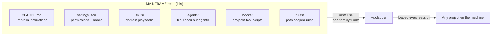
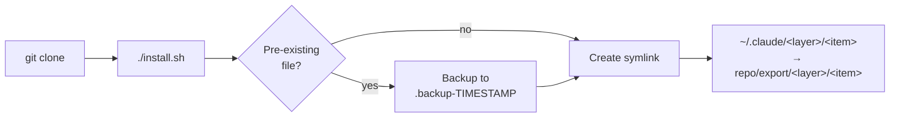
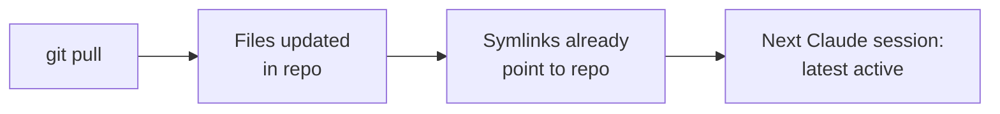
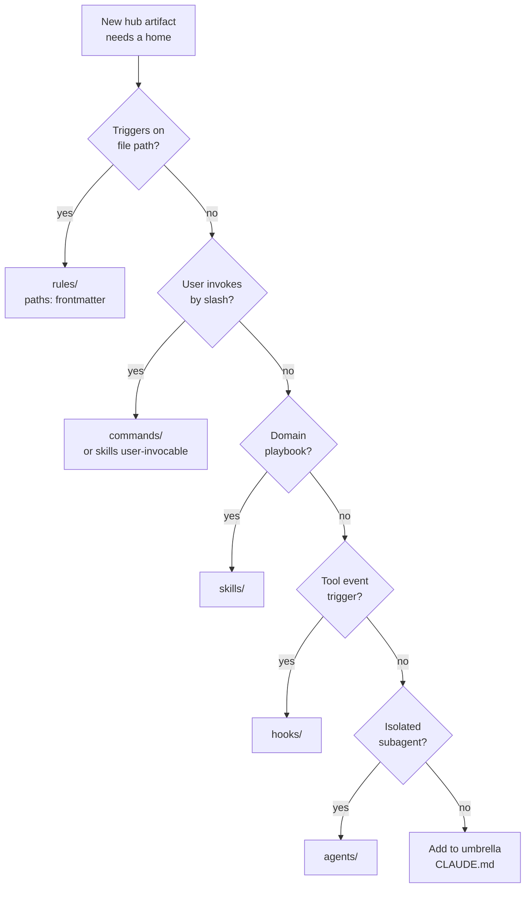

<p align="center">
  
</p>

# MAINFRAME

[](LICENSE)
[](https://code.claude.com)
[]()
[](#principles)

 Maintained by [@CATWILLgh](https://github.com/CATWILLgh)

A personal hub of global Claude Code customizations — `CLAUDE.md` umbrella, skills, agents, hooks, rules — that take effect across every project on the machine through symlinks into `~/.claude/`.

> **Personal-use.** No support, no compatibility guarantees, no backwards-compatibility promises. Forks are welcome under MIT, but this hub is shaped to one engineer's workflow.

<p align="center">
  
</p>

## Architecture



Each artifact type lives in its own layer with a specified contract. See [`docs/layers/`](docs/layers/) for full layer specifications.

<p align="center">
  
</p>

## Install

```bash
git clone https://github.com/CATWILLgh/MAINFRAME ~/Documents/projects/MAINFRAME
cd ~/Documents/projects/MAINFRAME
./install.sh
```



What `install.sh` does:

- **Per-item symlinks** from `export/{skills,hooks,rules,agents,commands,output-styles}/*` into matching directories under `~/.claude/`. Composes with any existing user-created skills/hooks/rules — does NOT replace the whole directory.
- **Backs up** any pre-existing real file before replacing with a symlink.
- **Idempotent** — re-running is a no-op when state matches.
- **Drift cleanup** — removes managed symlinks whose source disappeared since the last run.

Options:

```
./install.sh              # install (with backups)
./install.sh --dry-run    # preview, no changes
./install.sh --uninstall  # remove managed symlinks
./install.sh --help
```

<p align="center">
  
</p>

## Update

```bash
cd ~/Documents/projects/MAINFRAME
git pull
```

That's it. Symlinks point to files in this repo — the next Claude Code session sees the latest. Re-run `install.sh` **only** if a new top-level directory appeared under `export/`.



<p align="center">
  
</p>

## What's inside

| Path | Purpose |
|------|---------|
| [`export/CLAUDE.md`](export/CLAUDE.md) | Umbrella operating instructions — loaded into every Claude Code session globally |
| [`export/settings.json`](export/settings.json) | Permission rules (allow/ask/deny) + hook registration |
| [`export/skills/`](export/skills/) | Claude Code skills — domain playbooks (code audit, secrets, testing strategy, stack-specific backend/frontend patterns, etc.) |
| [`export/agents/`](export/agents/) | File-based subagents: `react-frontend-engineer`, `python-backend-engineer`, `nestjs-backend-engineer`, `web-search` |
| [`export/hooks/`](export/hooks/) | Pre/post-tool-use Python scripts for live validation and safety (security scans, suppression-marker detection, comment discipline) |
| [`export/rules/`](export/rules/) | Path-scoped rule files loaded on-demand via `paths:` frontmatter |
| [`export/commands/`](export/commands/) | Slash commands |
| [`export/output-styles/`](export/output-styles/) | Output style overrides |
| [`tools/`](tools/) | Python validators for `CLAUDE.md` and `SKILL.md` (run by hooks, also runnable manually) |
| [`docs/layers/`](docs/layers/) | Architecture specs per layer |

<p align="center">
  
</p>

## Layer architecture

Each artifact type has its own layer with explicit contract: where it lives, what frontmatter it carries, what limits apply, when it activates. New artifacts go through a decision tree to land in the correct layer.



| Layer | Spec |
|---|---|
| Umbrella `CLAUDE.md` | [`docs/layers/claude-md.md`](docs/layers/claude-md.md) |
| Skills | [`docs/layers/skills.md`](docs/layers/skills.md) |
| Agents | [`docs/layers/agents.md`](docs/layers/agents.md) |
| Hooks | [`docs/layers/hooks.md`](docs/layers/hooks.md) |
| Rules | [`docs/layers/rules.md`](docs/layers/rules.md) |
| Commands | [`docs/layers/commands.md`](docs/layers/commands.md) |
| Permissions | [`docs/layers/permissions.md`](docs/layers/permissions.md) |
| Settings | [`docs/layers/settings.md`](docs/layers/settings.md) |
| Output styles | [`docs/layers/output-styles.md`](docs/layers/output-styles.md) |
| Decision tree | [`docs/layers/decision-tree.md`](docs/layers/decision-tree.md) |

<p align="center">
  
</p>

## Principles

Every artifact in `export/` holds these:

1. **Project-agnostic** — no hardcoded project names, stacks, paths, or domains
2. **Evidence-based** — new rules need real experience, authoritative source, or measured experiment
3. **English in artifacts** — skills, agents, commands, hooks all in English (LLM adherence)
4. **Single source of truth** — each artifact exists in exactly one location in `export/`
5. **Sub-agent economy** — pick the right model per task (Haiku for trivial, Sonnet for most research, Opus only for genuine reasoning needs)

<p align="center">
  
</p>

## Contributing

See [CONTRIBUTING.md](CONTRIBUTING.md) for fork conventions, principles, validators, and commit format.

<p align="center">
  
</p>

## License

[MIT](LICENSE) — use, fork, modify freely, no warranty.
