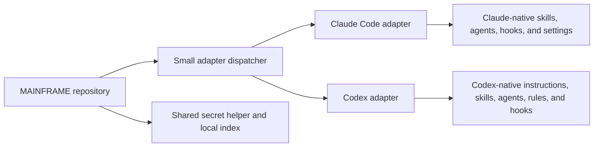

<p align="center">
  
</p>

# MAINFRAME

[](https://github.com/CATWILLgh/MAINFRAME/actions/workflows/ci.yml)
[](LICENSE)
[](https://code.claude.com)
[](https://learn.chatgpt.com/docs/app)
[](#project-status)

Maintained by [@CATWILLgh](https://github.com/CATWILLgh).

MAINFRAME is a personal operating layer for AI coding agents. Its adapters give every project the same small baseline while preserving the native strengths and limits of each product.

It is not a framework for your application and it does not replace the rules of an individual project. It changes how the selected coding agent approaches the work around that project.

> **Personal-use project.** MAINFRAME is published openly under MIT, but it follows one working environment first. There are no support or backwards-compatibility guarantees.

## Why it exists

AI coding agents can be useful across many projects, but the same problems tend to return:

- useful instructions must be explained again in every repository;
- one large instruction file becomes noisy and its important parts are easier to miss;
- a long run can drift away from the agreed result;
- specialist knowledge is often loaded when it is not needed, or not loaded when it is;
- small safety checks are easy to forget until a mistake has already become expensive.

MAINFRAME keeps that reusable layer outside individual projects. The automatic part stays deliberately small. Heavier process and specialist knowledge are loaded only when the task calls for them.

The aim is simple: improve the minimum quality of agent work without turning delivery machinery into the product.

## What it adds

| Part | Plain-language purpose |
|---|---|
| Global baseline | Small, role-neutral instructions for evidence, safety, secrets, and authority boundaries. |
| Primary-session init | A manual collaboration mode for goals, product decisions, and larger tasks. |
| Skills | Focused guidance for a stack or kind of work, loaded when it is useful instead of being placed in one giant prompt. |
| Specialist agents | Adapter-native profiles for research, engineering, testing, decision review, and final review. |
| Hooks | Adapter-native checks around relevant tool and session events, with current-change attribution and bounded feedback. |
| Settings and secrets | Adapter-owned settings where justified, plus a shared secret helper and local credentials index without secret values. |
| Development mode | Claude Code telemetry, feedback tools, and a desktop observability page for improving MAINFRAME itself. |

Hooks support engineering judgment; they do not replace tests, product checks, or a real review of risky work.

## How it works



The repository is the source of truth. Each adapter owns its delivery and preserves mutable user configuration. Reinstalling is designed to be repeatable and to fail before replacing an unknown file without explicit approval.

Only the small global baseline is present everywhere. Primary-session orchestration lives in the manual `init` skill, and stack-specific rules stay with the specialists that need them. This avoids giving a sub-agent instructions intended only for the main conversation.

## Quick start

### Requirements

- Claude Code `2.1.226` or newer for the Claude adapter, or a current Codex Desktop/CLI installation for the Codex adapter;
- Git;
- Bash `3.2` or newer;
- Python `3`.

Some quality checks use optional tools when they are available, including Node.js, Ruff, Oxlint, and Fallow.

### Install

```bash
git clone https://github.com/CATWILLgh/MAINFRAME ~/Documents/projects/MAINFRAME
cd ~/Documents/projects/MAINFRAME
./install.sh --claude
```

For the first Codex baseline instead:

```bash
./install.sh --codex
```

The installer explains every changed path and backs up conflicting files before replacing them. Run it again at any time; the operation is idempotent.

To see the result without changing anything:

```bash
./install.sh --claude --dry-run
```

Replace `--claude` with `--codex` to inspect Codex delivery. Codex installs a recipient-neutral global `AGENTS.md`, explicit skills, native specialist agents, command rules, reviewed native hooks, the shared credentials index, and a least-privilege permission profile for Desktop, CLI, and the IDE extension. The installer merges only its owned configuration and hook groups, preserves unrelated settings, and can remove only its own changes later. New or changed hooks still require review through `/hooks`.

Start a new Claude Code session after installation. For a MAINFRAME-guided primary session, run:

```text
/mainframe:init
```

In Codex, invoke `$mainframe-init` explicitly in the task.
To resolve one ticket that needs a product or infrastructure decision, invoke
`$mainframe-init` and name that ticket's four-character id.
For a ticket pipeline run, start native Goal mode and explicitly invoke
`$mainframe-tickets-find`, `$mainframe-tickets-refine`,
`$mainframe-tickets-implement`, or `$mainframe-tickets-verify` with an optional
plain-language scope.

Small, obvious tasks can stay direct. `init` is for work that benefits from shared understanding, preparation, or a longer autonomous run.

## A normal session

1. Claude receives the small global safety and evidence baseline.
2. For collaborative or complex work, the user starts `/mainframe:init`.
3. Claude discusses the actual outcome in plain language. If the task needs a formal definition of done, it is agreed before implementation.
4. When a red test can prove the original problem, it is prepared after the definition of done and before implementation.
5. The user starts the approved complex run through Claude Code's native `/goal` mechanism.
6. The primary agent chooses specialist help when it is useful. Hooks check the changes that the current work actually introduced.
7. The result is verified and reported in the user's language without requiring the user to inspect the code.

Business behavior, infrastructure choices, destructive operations, branch changes, and pushes remain user decisions. Technical implementation inside the agreed boundary belongs to the agent. During a long run, small conventional commits may be used as recovery points; a push still requires an explicit request.

## Design principles

MAINFRAME is built around a few boundaries:

- **Small global context.** A rule is global only when every recipient benefits from it.
- **Context follows the role.** Main-session workflow, research methods, and stack-specific engineering rules live in different layers.
- **Evidence over habit.** Important claims come from the repository, a reproducible check, Context7, or a current primary source.
- **One source of truth.** Each delivered artifact has one editable home in this repository.
- **Agent-first, not agent-dependent.** Agents do the technical work, but the result remains normal code, standard tests, and ordinary project documentation that another engineer or agent can continue.
- **Enough process, not maximum process.** Small tasks stay small. Complex or high-risk tasks receive deeper preparation and independent review.
- **User authority stays explicit.** Product meaning, infrastructure, protected data, branch changes, and external delivery are never silently redefined.

Detailed technical reference will be added separately and linked from this page as it becomes ready.

## Origin and evolution

MAINFRAME began in May 2026 as a small personal collection of global Claude Code instructions, agents, skills, and hooks. The first goal was practical: stop rebuilding the same useful baseline in every project.

It grew out of daily work with AI coding agents across real applications. Repeated failures became rules or checks; ideas that sounded good but did not help in practice were removed. Documentation and small experiments became important because model knowledge and product behavior can change faster than memory does.

The project later explored a general multi-adapter delivery system and a terminal interface. That direction became too large. More effort was going into distributing the system than into improving the actual agent experience. The experiment was archived, and `main` deliberately returned to a smaller Claude-first architecture.

That reset is part of the project, not missing history. The current lesson is to make each adapter genuinely useful, keep shared pieces truly shared, and add adapters independently only when their own environment is understood. The first Codex baseline follows that rule; the old compiler and terminal UI are not part of the current product.

The exact technical history remains available in Git. This README keeps the human reason behind it: MAINFRAME is an evolving working system, corrected by actual use rather than presented as a finished universal answer.

## Managing the installation

### Update

```bash
cd ~/Documents/projects/MAINFRAME
git pull
./install.sh --claude
```

Use `--codex` instead to update the Codex baseline. Most linked content is current after `git pull`; re-running the selected installer also applies changes to regular managed files and delivery wiring.

### Development mode

Development mode is enabled independently for each adapter:

```bash
./install.sh --claude --dev
./install.sh --codex --dev
```

Development mode adds local instrumentation for maintaining this repository. Claude Code and Codex keep separate adapter-owned SQLite databases. Their normal telemetry stays on the machine and records operational metadata rather than prompts, code, file paths, tool input or output, findings, or hook messages.

For native model-usage counters, prepare the repository development environment once:

```bash
.venv/bin/pip install -r tools/telemetry-requirements.txt
tools/mainframe-observatory.sh start
```

The `--dev` installers also start this local receiver when its dependencies are available. It accepts only localhost OTLP logs and persists an allowlist of numeric token counters, model, and opaque session identifiers. Check or stop it with `tools/mainframe-observatory.sh status` and `tools/mainframe-observatory.sh stop`.

It also generates the local desktop page at `workspace/runtime/hub.html`. To keep that file refreshed temporarily while developing MAINFRAME:

```bash
.venv/bin/python3 tools/build_hub_page.py --watch --interval 15
```

Open the generated file, not `tools/hub_page_assets/template.html`; the latter is only the source template.

The same validated report is available to machine readers:

```bash
python3 tools/telemetry_data.py --all --pretty
```

The report deliberately separates three kinds of evidence: exact token counters reported by the runtime, a broad character-based estimate for MAINFRAME-injected context, and causal overhead. Causal overhead remains `unproven` until comparable A/B runs exist; model-lab analysis cannot promote an estimate into a measured fact.

Installing an adapter again without `--dev` disables only that adapter's development instrumentation while preserving already collected local data.

### Uninstall

```bash
./install.sh --claude --uninstall
```

Use `--codex --uninstall` for Codex. Uninstall removes only MAINFRAME-owned files and links. Credentials, the repository index, unrelated user configuration, backups, telemetry, and feedback data are preserved.

## Repository map

```text
MAINFRAME/
├── adapters/claude-code/   Claude Code delivery, agents, skills, hooks, and settings
├── adapters/codex/         Codex-native cross-surface baseline and delivery
├── shared/credentials/     adapter-independent secret helper and local index template
├── dev/                    opt-in tools used while developing MAINFRAME
├── tools/                  validators, tests, and local observability builders
├── install.sh              small adapter dispatcher
└── CONTRIBUTING.md         contribution and validation guide
```

Each adapter has its own delivery logic. The Codex adapter intentionally starts smaller than the mature Claude Code adapter and grows only through verified Codex-native behavior; the removed shared compiler and terminal installer stay removed.

## Tested environment

- **macOS** is the primary daily environment.
- **Linux** is expected to work with the Bash installer, but receives less real-world use.
- **Windows** is not currently supported.
- The main sessions are tuned through actual use with Claude Opus; specialist profiles choose their own configured model and effort.
- The Codex baseline was verified with Desktop `26.810.52044`, its bundled `codex-cli 0.148.0-alpha.9`, and standalone CLI `0.147.0`; real usage evidence is still being collected.

Other combinations may work, but they should be treated as unverified until someone tests them in real sessions.

## Project status

This is a personal tool under active development. Interfaces, names, and behavior may change when real use shows a better design. The repository is public so other people can study it, fork it, or reuse the pieces that fit their own work.

## A personal note

I am not a credentialed engineer or researcher. I started building with AI agents because I enjoyed it, then kept going until those experiments became real projects used in practice. Git came later; before that, everything lived only on my machine.

MAINFRAME is the reusable part of what I learned along the way. It exists because I could not find another public repository that quite matched this problem and working style. There may be better systems, and this one will not fit everyone. It is simply the one I use and keep improving.

If it helps, use it. If only one idea is useful, take that idea. There is no need to adopt the whole system.

## Contributing

Forks, experiments, and evidence from other models or environments are welcome. Please keep changes narrow, explain the real problem they solve, and avoid adding permanent global context "just in case."

See [CONTRIBUTING.md](CONTRIBUTING.md) for the repository workflow and validation commands.

## License

[MIT](LICENSE) — use, fork, and modify freely; no warranty.
