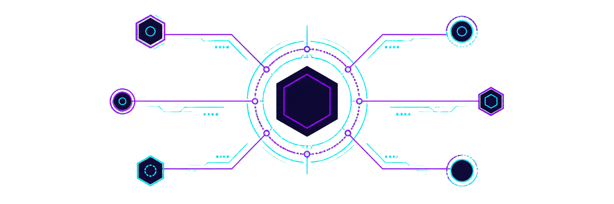
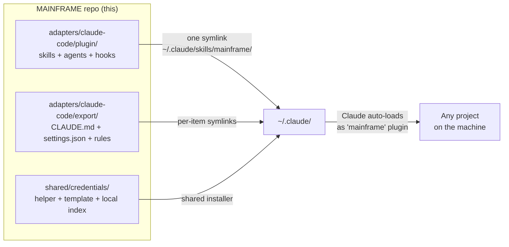
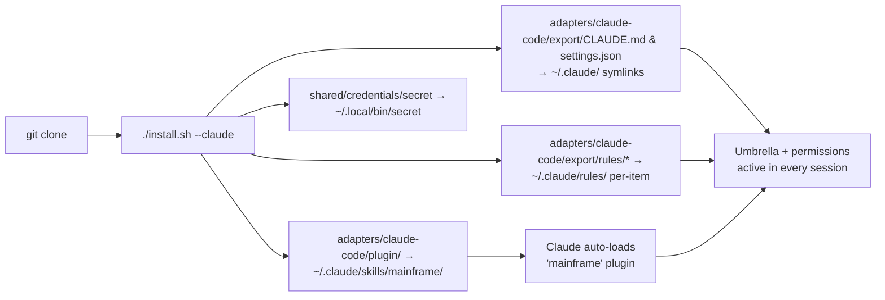
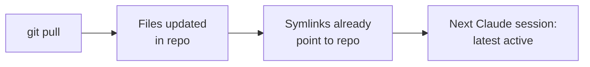
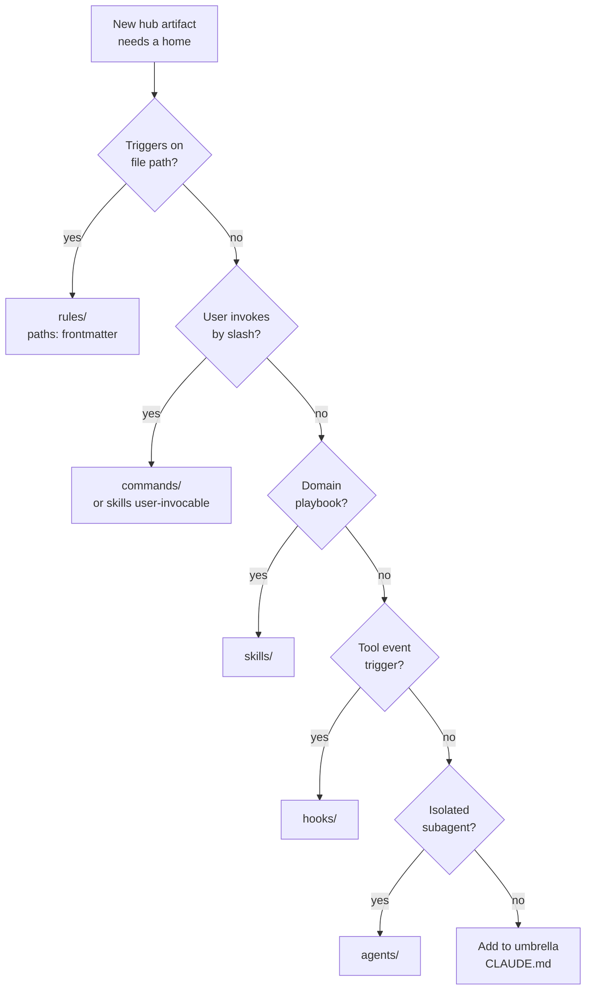

<p align="center">
  
</p>

# MAINFRAME

[](https://github.com/CATWILLgh/MAINFRAME/actions/workflows/ci.yml)
[](LICENSE)
[](https://code.claude.com)
[]()
[](#platforms)
[](#tested-configuration)
[](https://github.com/CATWILLgh/MAINFRAME/commits)
[](adapters/claude-code/plugin/skills)
[](adapters/claude-code/plugin/agents)
[](adapters/claude-code/plugin/hooks/scripts)
[](#principles)

 Maintained by [@CATWILLgh](https://github.com/CATWILLgh)

A baseline of operating rules, focused sub-agents, and small automatic checks I want to apply in **every** Claude Code session on my machine. Set up once — every project, every session, inherits the same discipline.

> **Architecture review in progress.** The current hub is being reconsidered
> through a user interview. Confirmed principles and the separation of context
> by recipient are recorded in [`docs/principles.md`](docs/principles.md).

It's shaped for one workflow in particular: long **auto-mode** runs — hours, sometimes days, where Claude and I plan a larger feature up front, then it executes on its own with no one watching each step. Every rule, hook, and permission tier here is built to hold quality through exactly that: an unattended run where a missed check turns into a bug nobody catches until later.

## Engineering at a glance

For the technically curious — the concrete engineering this repo demonstrates, not the motivation behind it:

- **Fail-open hooks.** Every check exits cleanly when its tool is missing or it errors, so the hook layer can never break a session — safety that degrades to silence, never to a stall.
- **A git-level secret gate.** A `PreToolUse` hook scans the staged diff and blocks `git commit` when a high-confidence credential is present — caught before it ever reaches history, not after.
- **Size budgets against lost-in-the-middle.** Skills, agents, and hooks are capped at ≤5K tokens — a limit calibrated to the runtime's compaction behaviour so the content survives a context compaction intact instead of being truncated.
- **Covered by tests and CI.** ~90 stdlib-Python tests, zero third-party runtime dependencies, run on every push (the CI badge above) alongside the format/size validators.

> **Personal-use.** No support, no compatibility guarantees, no backwards-compatibility promises. Forks are welcome under MIT, but this hub is shaped to one engineer's workflow.

<p align="center">
  
</p>

## Why this exists

Working with Claude Code (or any AI coding agent) on multiple projects, you keep running into the same friction:

- **Same baseline, every time.** You re-deploy the same useful sub-agents, the same operating rules, the same little safety checks for every new project. Manually. Forever.
- **Project-level config doesn't scale.** Putting it all into the project's own `CLAUDE.md` works — until that file grows. Then attention scatters, the well-known **lost-in-the-middle** problem kicks in, and important rules quietly stop being followed mid-session.
- **The agent itself bloats its own config.** Left to its habits, Claude keeps appending new instructions to `CLAUDE.md`. The file grows, focus thins, the rules crumble. And so it grows, slowly, until you notice the discipline you started with is gone.

This repo is my attempt to do that baseline layer **separately** from any specific project, with deliberate size limits and small reminders so things don't drift:

- Strict file-size budgets on skills, agents, hooks. A file gets too big — a hook nudges me.
- Skills and agents stay granular and narrowly focused — at any moment, only the most relevant context is loaded, not a soup of "a little bit of everything".
- Constantly iterating: try a new approach, see what stabilizes Claude's behavior, keep what works, drop what doesn't.
- Every decision cross-checked against authoritative sources (Anthropic docs, RFCs, well-known engineering material) — not "feels right".

**Honest disclaimer.** I'm not claiming this hub closes every pain. Some friction with AI agents is just current-generation model limits — the best a hub can do is smooth them, not fix them. What I am aiming for: a higher minimum quality of output code by default. On long-running development that pays back many times over — problems caught and prevented up front instead of bugs to chase later, by you or by the agent.

<p align="center">
  
</p>

## Where this comes from

This isn't a weekend project or a copied template. It's distilled from thousands of hours of working with AI coding agents, day after day — what consistently helped, what quietly broke, what was worth keeping. Every rule here earned its place by surviving real use.

Three things shape it:

- **Hard-won experience.** The rules come from patterns I hit over and over on real projects — not from theory.
- **Authoritative sources.** I don't ship a rule on a hunch. Each non-trivial decision is checked against primary sources — Anthropic's own docs, RFCs, established engineering material — and validated with a small experiment where I can.
- **Constant feedback.** I work on this almost every day, together with the agent. When something underperforms in real use, it gets refined or dropped. The hub is never "finished" — it's continuously corrected against what actually happens.

And here's the part that's easy to miss. It looks like just a folder of Markdown files — some skills, a few agents. It isn't. Steering a language model reliably, across many projects and long autonomous runs, is one of the genuinely hard parts of working with agentic systems. The model's inference — how it generates each step — is a kind of *ordered chaos*: powerful, but hard to keep pointed in the right direction at scale. This hub is my standing attempt to put just enough structure around that chaos to make the output dependable, without strangling what the model is good at.

<p align="center">
  
</p>

## What you actually get

In plain words — what each piece is for:

- **Umbrella `CLAUDE.md`** — a minimal role-agnostic contract shared by the primary agent and sub-agents: stay inside the caller's scope, ground important claims, protect secrets, and respect authority boundaries. It contains no user orchestration or stack-specific engineering process.
- **Manual `/mainframe:init`** — the primary-session context for partnership, user decisions, definitions of done, execution routing, Git authority, and final delivery. Its heavier complex-task workflow and external Codex review instructions load only when needed.
- **Skills** — small focused playbooks Claude pulls when they're relevant. Things like code review, test selection, secret handling, or stack-specific implementation guidance — instead of one giant document trying to cover everything.
- **Agents (sub-agents)** — pre-configured specialists with their own model and effort level wired in. Backend engineers for Python, Node.js, and Next.js (App Router server layer), a frontend engineer for React, a devops engineer for deploys and infra, a decision-reviewer for high-stakes design calls, and a web-search agent for authoritative source-checking. You don't have to remember which model to pick for what — the right one is already attached.
- **Hooks** — small automatic checks that run on tool events. Catch leftover `TODO`/`FIXME` markers before commit. Warn on risky bash patterns. Scan diffs for security issues with `ruff`/`semgrep`/`osv-scanner`. Block a finished turn when a real problem is still unresolved. Things that fire without you having to remember to fire them — the full list with what each one does is in [Inventory](#inventory--whats-actually-inside) below.
- **Rules** — small path-scoped guidance files that load on demand when Claude reads a matching path. Doesn't bloat the global context.
- **Permissions** — three-tier model (deny / ask / allow) that's strict by default. Some things must never run; some need confirmation; the rest run quietly with logging.

End result the hub aims for: **the same baseline of quality and discipline applied to every project on your machine — without re-configuring Claude each time or babysitting it through a long unattended run.** When the baseline is high, day-to-day output is more predictable and bug rate drops.

<p align="center">
  
</p>

## Inventory — what's actually inside

The concrete list of everything the hub ships, in plain words. Three groups: **agents** (specialist sub-agents you delegate to), **hooks** (automatic checks on tool events), **skills** (focused playbooks Claude pulls when relevant).

### Agents — 7 specialist sub-agents

Each ships with its model and effort already wired in, calibrated separately so you don't pick at call time. Invoked as `subagent_type: "mainframe:<name>"`.

| Agent | What it's for | Model |
|---|---|---|
| `python-backend-engineer` | Python backend work — FastAPI / Django / Flask endpoints, ORM models, auth, background workers | Sonnet |
| `nestjs-backend-engineer` | Node.js / NestJS backend — endpoints, ORM, auth, WebSocket gateways, queue workers | Sonnet |
| `nextjs-backend-engineer` | Next.js App Router server layer — route handlers, server actions, RSC data, caching, auth | Sonnet |
| `react-frontend-engineer` | React + Vite frontend — pages, components, forms, data fetching, API integration | Sonnet |
| `devops-engineer` | Deploys, CI/CD, containers, infra config, managed databases, Dokploy | Opus |
| `decision-reviewer` | Adversarial, evidence-grounded second look at a high-stakes design or approach before you commit | Opus |
| `web-search` | Authoritative source lookup — Context7 docs + live web, returns cited quotes | Sonnet (low) |

### Hooks — what each one checks, and when

Hooks fire on tool-lifecycle events. Two kinds: a **gate** can block or ask (it stops the action or the turn until something is fixed); an **advisory** only injects a note and never blocks. The core design is **warn early, block at the end** — when you edit a file the advisory scanners flag a problem immediately, and if it's still unresolved when Claude tries to finish, the matching **Stop-gate** blocks the finish. So a real issue can't quietly slip through to the end of an unattended run. Every hook is fail-safe: if it errors, or its tool isn't installed, it exits silently and never breaks your session.

#### At session start — `SessionStart` (fresh start, resume, `/clear`, and after every compaction)

- **`hooklib-smoke-check.py`** — Self-test that the shared hook library imports cleanly. Every other hook silently no-ops if that library is broken, so this one announces the failure loudly at session start instead of letting the whole hook layer go dark unnoticed.

#### Before a Bash command — `PreToolUse` on Bash

- **`secret-commit-gate.py`** — *Gate (blocks).* When the command is a `git commit`, scans the staged diff for high-confidence secret shapes (vendor API tokens, private keys) and blocks the commit if one is staged. Skips repos that use SOPS or git-crypt; defers on any error rather than risk a false block.
- **`path-validation.py`** — *Gate (asks).* Parses a recursive `rm -rf`, resolves every target path, and allows it silently when all targets are inside the project — but asks for confirmation if any path is outside the project, unresolved, or built from a subshell. Anything that isn't a recursive `rm` passes straight through.
- **`bash-pattern-reminder.py`** — *Advisory.* Catches commands that historically trigger auto-mode permission prompts or stall a hands-off run (literal `rm -rf`, heredoc/redirect into `/tmp`, ad-hoc global installs) and suggests the friction-free alternative (the Write tool, the installer's helper). Non-blocking on purpose — a block would become a freeze in auto-mode.
#### Right after you edit a file — `PostToolUse` on Edit / Write / MultiEdit (all advisory — the "warn early" half)

- **`scan-suppression-markers.py`** — Flags suppression markers (`TODO` / `FIXME` / `HACK`, skipped or focused tests, `@ts-ignore` / `eslint-disable` / `# noqa`) and debug residue (`debugger`, `breakpoint()`, `console.debug`, `var_dump` / `dd`) that the edit just introduced. Diff-aware: it flags only what the change added, not what was already there.
- **`comment-discipline-reminder.py`** — Flags comments the edit just added that match a banned form — process narration, redundant paraphrase of the code, position / phase markers, journal / byline notes. The "comment the WHY, not the WHAT" rule, surfaced at write time.
- **`ticket-id-format-reminder.py`** — On a new `docs/tickets/<id>-*.md` whose id is a short sequential number (`NNN`), nudges to use a random 8-hex id instead (`openssl rand -hex 4`). Sequential ids collide when several branches or agents each allocate "the next number" independently; random ones don't. Write-only, so editing a legacy `NNN` ticket doesn't nag.
- **`python-security-scan.py`** — Runs Ruff's curated S (flake8-bandit, OWASP-aligned) + B (flake8-bugbear) rules over the changed Python and notes high-confidence dangerous patterns and correctness bugs — `pickle.load`, unsafe `yaml.load`, `subprocess(..., shell=True)`, and similar.
- **`python-deps-audit.py`** — When a Python dependency file changes, runs `pip-audit` and notes known CVEs in the dependency tree.
- **`nodejs-security-scan.py`** — Runs oxlint's curated dangerous-pattern subset over the changed JS / TS — classic RCE (`eval`, `new Function`), unsafe React, and more — and notes the hits.
- **`nodejs-deps-audit.py`** — When a Node dependency file changes, runs `osv-scanner` and notes known CVEs.

#### Before the turn ends — `Stop` (the final gates, plus a few advisory notes)

- **`stop-gate-suppression-markers.py`** — *Gate (blocks).* Blocks the turn from finishing while suppression markers or debug residue added this session remain unresolved — the hard backstop to the advisory scanner above.
- **`stop-gate-comment-discipline.py`** — *Gate (blocks).* Blocks finishing while banned narration comments (measured against `git HEAD`) remain.
- **`python-security-stop-gate.py`** — *Gate (blocks).* Blocks finishing while unresolved Ruff security findings remain in changed Python.
- **`nodejs-security-stop-gate.py`** — *Gate (blocks).* Blocks finishing while unresolved Semgrep security findings remain in changed JS / TS (using the YAML rules under `hooks/rules/`).
- **`frontend-fsd-gate.py`** — *Gate (blocks).* Blocks finishing on Feature-Sliced-Design import-direction violations (a lower layer importing an upper one), via dependency-cruiser.
- **`frontend-dead-code.py`** — *Advisory.* Notes dead / unused files via Knip. Opt-in per project.
- **`fallow-quality-note.py`** — *Advisory.* Notes quality smells in changed TS / JS — import cycles, layer-boundary breaks, dead files, over-complexity, copy-paste — via the `fallow` analyzer. Throttled, conservative categories only.
- **`memory-reminder.py`** — *Advisory.* A main-session-only nudge to save a durable cross-session fact to Claude's native auto-memory after a substantive session. Throttled (~30 min), skips trivial sessions and subagents, and is framed so "nothing worth saving" is a fine answer.

#### Always-on, and the plumbing

- **`telemetry.py`** — *(dev-only.)* Fires across many events — session start/end, skill loads, file edits, todo-list updates, permission denials, sub-agent starts — and logs local-only event metadata (counts and coarse buckets, never prompts, code, todo text, or file paths) into a local SQLite DB. Present only when the `--dev` instrumentation is installed; on a plain install it isn't wired and writes nothing.
- **Shared libraries** (not hooks themselves): `_hooklib.py` — common scaffolding (payload parsing, the emit / gate helpers, git diffing); `_markers.py` — the suppression-marker and debug-residue detector sets; `comment_extract.py` — false-positive-free comment / docstring extraction.

### Skills — 17 focused playbooks

Most are pulled automatically when the situation matches. The primary-session
`init` skill is invoked manually as `/mainframe:init`.

| Group | Skills |
|---|---|
| **Process & quality** | `init` (manual primary-session context, with the complex workflow loaded only when needed), `surface-ticket` (record deferred problems), `no-suppression-markers` (completion gate), `testing-strategy` (choose test evidence), `severity-calibration` (rank findings honestly), `code-audit` (parallel multi-aspect review), `decision-review` (validate an approach) |
| **Backend** | `python-backend-patterns`, `nestjs-backend-patterns`, `nextjs-backend-patterns` — stack recon + ORM / validation / auth / observability patterns |
| **Frontend** | `react-frontend-patterns` (FSD, state, data fetching), `frontend-design` (colour, type, a11y, motion, layout), `shadcn` (shadcn/ui composition) |
| **Ops & misc** | `ops-app-server-safety` (no duplicate servers, safe stops), `dokploy-api` (Dokploy PaaS HTTP API), `curl-requests` (HTTP request templates), `secrets-handling` (credentials layout + pre-reply secret scan) |

<p align="center">
  
</p>

## Architecture



The hub ships through one adapter plus one shared component:

- **The Claude Code plugin** (`adapters/claude-code/plugin/`) carries skills, agents, and hooks. Its manual `init` skill is available as `/mainframe:init` and is not loaded until the user invokes it.
- **Claude Code exports** (`adapters/claude-code/export/`) carry the umbrella `CLAUDE.md`, `settings.json`, path-scoped `rules/`, and output styles.
- **Shared secrets** (`shared/credentials/`) own the `secret` helper, the tracked initialization template, and the gitignored credentials index used by every adapter.

See [`docs/layers/`](docs/layers/) for full per-layer specifications.

<p align="center">
  
</p>

## Requirements

**Required:**

- **Claude Code v2.1+** — the host (CLI or IDE extension).
- **git** — to clone the repo, and for the hooks that diff your working tree.
- **Bash 3.2+** — to run `install.sh` (macOS system Bash is fine; no GNU-only extensions used).
- **Python 3** — every shipped hook is stdlib Python 3 (they shell out to the linters below, but need no Python packages of their own). Without Python 3 they silently no-op (the installer warns; it does not fail).

**Recommended — each unlocks a group of checks; anything missing just stays silent, and `install.sh` prints an OS-specific install hint:**

- **Node.js / npm** — the React and Node.js agents, the shadcn CLI (`npx`), the frontend recon script, and the JS hooks (`oxlint`, `dependency-cruiser`, `knip`, `fallow`). `install.sh` installs the four hook tools as npm globals for you.
- **uv or pipx** — installs the Python-packaged linters the hooks call: `ruff`, `semgrep`, `pip-audit` (`semgrep` powers the JS/TS security stop-gate, but installs as a Python package).
- **osv-scanner** — the dependency-vulnerability hook (`install.sh` can fetch the binary for you).

Nothing here hard-fails a session: a tool that isn't installed disables only its own hook. Run `./install.sh --claude --dry-run` to preview everything and see exactly what's missing.

<p align="center">
  
</p>

## Install

```bash
git clone https://github.com/CATWILLgh/MAINFRAME ~/Documents/projects/MAINFRAME
cd ~/Documents/projects/MAINFRAME
./install.sh --claude
```



What `install.sh` does:

- **One symlink for the plugin** — `adapters/claude-code/plugin/` becomes `~/.claude/skills/mainframe/`. Claude Code auto-loads it and prefixes everything inside with the `mainframe:` namespace.
- **Single-file symlinks** for the umbrella `CLAUDE.md` and the permission `settings.json` (the plugin format does not provide an equivalent for these).
- **Per-item symlinks** for `adapters/claude-code/export/rules/*` into `~/.claude/rules/`, so the hub composes with any rules you already have without replacing the whole directory.
- **Shared credentials component** — links `shared/credentials/secret` into `~/.local/bin/`, preserves the values under `~/.config/credentials/`, and seeds the gitignored `shared/credentials/credentials-index.md` from its adjacent template only when missing.
- **Stale-symlink cleanup** — on first run after upgrading from the older per-item layout, removes leftover hub symlinks under `~/.claude/{skills,agents,hooks}/`.
- **Backs up** any pre-existing real file before replacing it with a symlink.
- **Idempotent** — re-running is a no-op when state matches.

Options:

```
./install.sh                         # show help; make no changes
./install.sh --claude                # install shared secrets + Claude Code
./install.sh --claude --dev          # also install hub-development instrumentation
./install.sh --claude --dry-run      # preview, no changes
./install.sh --claude --uninstall    # remove only the Claude Code adapter
./install.sh --help
```

**`--dev` — hub-development instrumentation (most users don't need this).** A plain install ships none of it. The flag adds three opt-in pieces, all strictly local; their data lives inside the repo at `workspace/runtime/` (gitignored), reached via the hub-owned symlink `~/.claude/mainframe`:

- **`harness-feedback` skill** (`dev/skills/`) — agents file structured friction reports about the hub's own rules/hooks into `~/.claude/mainframe/feedback/` for later triage. Without the skill installed, the related nudges in hook output stay silent.
- **Usage telemetry** — hooks log event metadata (no prompts, no code, no paths) into a local SQLite DB under `~/.claude/mainframe/telemetry/`, and only while that hub-owned namespace exists. Nothing is ever sent anywhere. Remove the symlink to stop logging.
- **Local hub map** — a self-contained `workspace/runtime/hub.html` page. A searchable catalog of every skill, agent, and hook — click any card, or any graph node, for its details and what references it; the hook trigger matrix; a **Config** panel showing the permission tiers and key settings; a **Health** panel that surfaces broken cross-references, orphaned skills, and missing hook scripts; a telemetry panel broken down by agent, by day, and by miss type; and a relationship graph. Generated on `--dev` install; regenerate any time with `.venv/bin/python3 tools/build_hub_page.py`. Open it straight from disk (no server) — it reads nothing remote.

To temporarily disable the plugin without uninstalling, use `claude plugin disable mainframe` (and `claude plugin enable mainframe` to re-enable).

<p align="center">
  
</p>

## Update

```bash
cd ~/Documents/projects/MAINFRAME
git pull
```

That's it. Symlinks point to files in this repo — the next Claude Code session sees the latest. Re-run `./install.sh --claude` **only** when delivery wiring changes.



<p align="center">
  
</p>

## Tested configuration

What I have actually verified this hub on:

- **Claude Code CLI** — the primary surface I use daily.
- **Claude Code IDE extension** — also in active use.
- **Main thread model**: Claude **Opus 4.7+** at `high` or `xhigh` effort (currently **Opus 4.8** day to day). This is what I run every day and what all the discipline is tuned against.
- **Sub-agents** — each one calibrated separately via a small empirical tournament so the right model + effort sits inside the agent file itself. You don't have to think about it at call time.

Other model / effort combinations may work but I haven't verified them. When an agent's prompt body changes in a meaningful way, I re-run its tournament.

**Trying the hub on other models or effort levels is very welcome** — Sonnet, Haiku, lower or higher effort, different IDEs. Share what you observe (open an issue or a PR with notes); empirical results on configurations I don't run daily are exactly the kind of feedback the hub gets better from.

**OpenAI Codex** support is in the future-list, not in scope yet.

<p align="center">
  
</p>

## Platforms

- **macOS** — primary, tested daily.
- **Linux** — should work; `install.sh` is plain Bash 3.2+ compatible, no macOS-specific paths.
- **Windows** — not supported yet, no timeline for it.

<p align="center">
  
</p>

## Directory map

```
MAINFRAME/
├── README.md, LICENSE, CONTRIBUTING.md   # project meta
├── install.sh                            # target dispatcher; no arguments show help
├── assets/                               # README images (banner, divider, badge)
│
├── adapters/claude-code/
│   ├── install.sh                        # Claude Code-only delivery
│   ├── plugin/                           # auto-loads as 'mainframe' after install
│   │   ├── .claude-plugin/plugin.json    # plugin manifest
│   │   ├── skills/                       # includes manual /mainframe:init
│   │   ├── agents/                       # file-based sub-agents
│   │   └── hooks/                        # registrations, scripts, and rules
│   └── export/                           # Claude files outside the plugin format
│       ├── CLAUDE.md                     # umbrella operating rules
│       ├── settings.json                 # permissions and settings
│       └── output-styles/                # custom reply styles
│
├── shared/credentials/                       # adapter-independent credentials component
│   ├── install.sh                        # installs only this shared component
│   ├── secret                            # credentials helper
│   ├── credentials-index.template.md     # initialization template
│   └── credentials-index.md              # local working index, gitignored
│
├── tools/                                # Python validators (used by hooks; runnable manually)
│   ├── validate-claude-md.py             # umbrella spec + project-agnosticism check
│   ├── validate-skill.py                 # skill format + size limits
│   └── agnostic-blacklist.txt.example    # copy to agnostic-blacklist.txt and add your own project names
│
└── docs/
    └── layers/                           # architecture spec per layer (skills, agents, hooks, rules, ...)
```

Anything you do not see here lives outside the repo by design — internal ADRs, working notes, the maintainer's inbox of unprocessed candidates, and per-machine memory are all gitignored. The published artifact is the hub itself, not the maintainer's working files.

<p align="center">
  
</p>

## Layer architecture

Each artifact type has its own layer with explicit contract: where it lives, what frontmatter it carries, what limits apply, when it activates. New artifacts go through a decision tree to land in the correct layer.



| Layer | Spec |
|---|---|
| Umbrella `CLAUDE.md` | [`docs/layers/claude-md.md`](docs/layers/claude-md.md) |
| Skills | [`docs/layers/skills.md`](docs/layers/skills.md) |
| Agents | [`docs/layers/agents.md`](docs/layers/agents.md) |
| Hooks | [`docs/layers/hooks.md`](docs/layers/hooks.md) |
| Rules | [`docs/layers/rules.md`](docs/layers/rules.md) |
| Commands | [`docs/layers/commands.md`](docs/layers/commands.md) |
| Permissions | [`docs/layers/permissions.md`](docs/layers/permissions.md) |
| Settings | [`docs/layers/settings.md`](docs/layers/settings.md) |
| Output styles | [`docs/layers/output-styles.md`](docs/layers/output-styles.md) |
| Decision tree | [`docs/layers/decision-tree.md`](docs/layers/decision-tree.md) |

<p align="center">
  
</p>

## Principles

Every artifact shipped by this hub (whether in `adapters/claude-code/plugin/` or `adapters/claude-code/export/`) holds these:

1. **Project-agnostic** — no hardcoded project names, stacks, paths, or domains.
2. **Evidence-based** — new rules need real experience, an authoritative source, or a measured experiment. Not "feels right".
3. **English in artifacts** — skills, agents, commands, hooks all in English (LLM adherence).
4. **Single source of truth** — each artifact exists in exactly one location in the repo.
5. **Sub-agent economy** — pick the right model per task (Haiku for trivial, Sonnet for most research, Opus only for genuine reasoning needs).

<p align="center">
  
</p>

## A personal note

I'm not a scientist or a credentialed engineer. I'm just someone who genuinely enjoys working with AI agents and models — and who has put a *lot* of hours into it over the past couple of years. To put it plainly: this year alone my Git history already shows over 2,300 private commits across 3+ production projects and counting; about 300 the year before; and before that, nothing — I worked entirely on my own machine and didn't even know how Git worked.

I started sharing this for people just getting into all of this, or looking for something new — because I hadn't come across repos quite like it. Maybe they're out there, somewhere at the bottom of GitHub; maybe some are even better than mine. But this one is mine, and I enjoy making it.

So if you want to try it, try it. If not, that's fine too — I'm not insisting on anything. Take what's useful, leave the rest.

<p align="center">
  
</p>

## Contributing

This is a personal hub but friends, acquaintances, and curious strangers are welcome to fork, adapt, and share what works. The repo gets better when more people poke at it from different angles — new approaches, sharper rules, things I haven't tried.

See [CONTRIBUTING.md](CONTRIBUTING.md) for fork conventions, principles, validators, and commit format.

<p align="center">
  
</p>

## License

[MIT](LICENSE) — use, fork, modify freely, no warranty.
