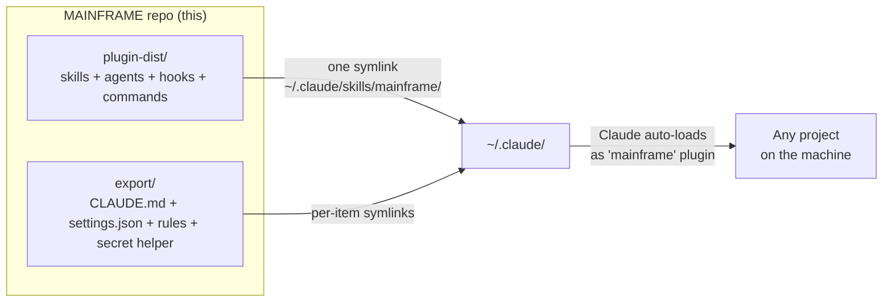
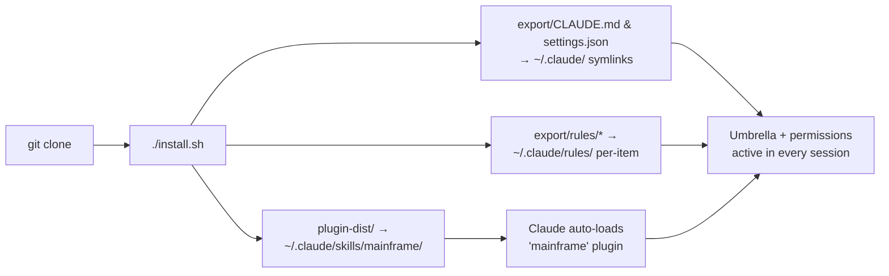
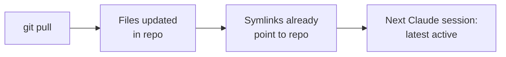
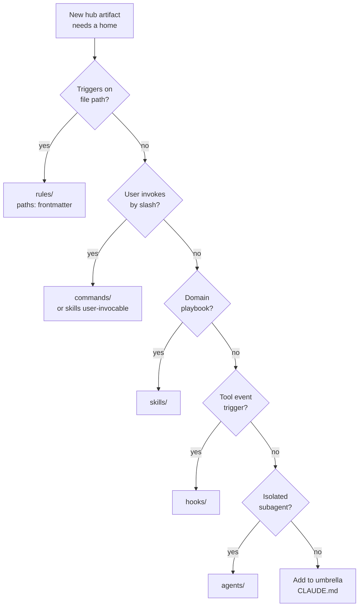

<p align="center">
  
</p>

# MAINFRAME

[](LICENSE)
[](https://code.claude.com)
[]()
[](#platforms)
[](#tested-configuration)
[](https://github.com/CATWILLgh/MAINFRAME/commits)
[](plugin-dist/skills)
[](plugin-dist/agents)
[](plugin-dist/hooks/scripts)
[](#principles)

 Maintained by [@CATWILLgh](https://github.com/CATWILLgh)

A baseline of operating rules, focused sub-agents, and small automatic checks I want to apply in **every** Claude Code session on my machine. Set up once — every project, every session, inherits the same discipline.

It's shaped for one workflow in particular: long **auto-mode** runs — hours, sometimes days, where Claude and I plan a larger feature up front, then it executes on its own with no one watching each step. Every rule, hook, and permission tier here is built to hold quality through exactly that: an unattended run where a missed check turns into a bug nobody catches until later.

> **Personal-use.** No support, no compatibility guarantees, no backwards-compatibility promises. Forks are welcome under MIT, but this hub is shaped to one engineer's workflow.

<p align="center">
  
</p>

## Why this exists

Working with Claude Code (or any AI coding agent) on multiple projects, you keep running into the same friction:

- **Same baseline, every time.** You re-deploy the same useful sub-agents, the same operating rules, the same little safety checks for every new project. Manually. Forever.
- **Project-level config doesn't scale.** Putting it all into the project's own `CLAUDE.md` works — until that file grows. Then attention scatters, the well-known **lost-in-the-middle** problem kicks in, and important rules quietly stop being followed mid-session.
- **The agent itself bloats its own config.** Left to its habits, Claude keeps appending new instructions to `CLAUDE.md`. The file grows, focus thins, the rules crumble. And so it grows, slowly, until you notice the discipline you started with is gone.

This repo is my attempt to do that baseline layer **separately** from any specific project, with deliberate size limits and small reminders so things don't drift:

- Strict file-size budgets on skills, agents, hooks. A file gets too big — a hook nudges me.
- Skills and agents stay granular and narrowly focused — at any moment, only the most relevant context is loaded, not a soup of "a little bit of everything".
- Constantly iterating: try a new approach, see what stabilizes Claude's behavior, keep what works, drop what doesn't.
- Every decision cross-checked against authoritative sources (Anthropic docs, RFCs, well-known engineering material) — not "feels right".

**Honest disclaimer.** I'm not claiming this hub closes every pain. Some friction with AI agents is just current-generation model limits — the best a hub can do is smooth them, not fix them. What I am aiming for: a higher minimum quality of output code by default. On long-running development that pays back many times over — problems caught and prevented up front instead of bugs to chase later, by you or by the agent.

<p align="center">
  
</p>

## Where this comes from

This isn't a weekend project or a copied template. It's distilled from thousands of hours of working with AI coding agents, day after day — what consistently helped, what quietly broke, what was worth keeping. Every rule here earned its place by surviving real use.

Three things shape it:

- **Hard-won experience.** The rules come from patterns I hit over and over on real projects — not from theory.
- **Authoritative sources.** I don't ship a rule on a hunch. Each non-trivial decision is checked against primary sources — Anthropic's own docs, RFCs, established engineering material — and validated with a small experiment where I can.
- **Constant feedback.** I work on this almost every day, together with the agent. When something underperforms in real use, it gets refined or dropped. The hub is never "finished" — it's continuously corrected against what actually happens.

And here's the part that's easy to miss. It looks like just a folder of Markdown files — some skills, a few agents. It isn't. Steering a language model reliably, across many projects and long autonomous runs, is one of the genuinely hard parts of working with agentic systems. The model's inference — how it generates each step — is a kind of *ordered chaos*: powerful, but hard to keep pointed in the right direction at scale. This hub is my standing attempt to put just enough structure around that chaos to make the output dependable, without strangling what the model is good at.

<p align="center">
  
</p>

## What you actually get

In plain words — what each piece is for:

- **Umbrella `CLAUDE.md`** — a tight set of working rules Claude follows in every project on your machine. Partnership-mode, honest pushback when I'm wrong, no flattery, source-checking before non-trivial decisions, atomic commits, no leftover `TODO`/`FIXME` markers, and so on. Around 160 lines, intentionally short to stay in focus.
- **Skills** — small focused playbooks Claude pulls when they're relevant. Things like "audit this code carefully", "format this commit message in Conventional Commits style", "scan this diff for forgotten secrets" — instead of one giant document trying to cover everything.
- **Agents (sub-agents)** — pre-configured specialists with their own model and effort level wired in. Backend engineers for Python, Node.js, and Next.js (App Router server layer), a frontend engineer for React, a devops engineer for deploys and infra, a decision-reviewer for high-stakes design calls, and a web-search agent for authoritative source-checking. You don't have to remember which model to pick for what — the right one is already attached.
- **Hooks** — small automatic checks that run on tool events. Catch leftover `TODO`/`FIXME` markers before commit. Warn on risky bash patterns. Scan diffs for security issues with `ruff`/`semgrep`/`osv-scanner`. Block a finished turn when a real problem is still unresolved. Things that fire without you having to remember to fire them — the full list with what each one does is in [Inventory](#inventory--whats-actually-inside) below.
- **Rules** — small path-scoped guidance files that load on demand when Claude reads a matching path. Doesn't bloat the global context.
- **Permissions** — three-tier model (deny / ask / allow) that's strict by default. Some things must never run; some need confirmation; the rest run quietly with logging.

End result the hub aims for: **the same baseline of quality and discipline applied to every project on your machine — without re-configuring Claude each time or babysitting it through a long unattended run.** When the baseline is high, day-to-day output is more predictable and bug rate drops.

<p align="center">
  
</p>

## Inventory — what's actually inside

The concrete list of everything the hub ships, in plain words. Three groups: **agents** (specialist sub-agents you delegate to), **hooks** (automatic checks on tool events), **skills** (focused playbooks Claude pulls when relevant).

### Agents — 7 specialist sub-agents

Each ships with its model and effort already wired in, calibrated separately so you don't pick at call time. Invoked as `subagent_type: "mainframe:<name>"`.

| Agent | What it's for | Model |
|---|---|---|
| `python-backend-engineer` | Python backend work — FastAPI / Django / Flask endpoints, ORM models, auth, background workers | Sonnet |
| `nestjs-backend-engineer` | Node.js / NestJS backend — endpoints, ORM, auth, WebSocket gateways, queue workers | Sonnet |
| `nextjs-backend-engineer` | Next.js App Router server layer — route handlers, server actions, RSC data, caching, auth | Sonnet |
| `react-frontend-engineer` | React + Vite frontend — pages, components, forms, data fetching, API integration | Sonnet |
| `devops-engineer` | Deploys, CI/CD, containers, infra config, managed databases, Dokploy | Opus |
| `decision-reviewer` | Adversarial, evidence-grounded second look at a high-stakes design or approach before you commit | Opus |
| `web-search` | Authoritative source lookup — Context7 docs + live web, returns cited quotes | Sonnet (low) |

### Hooks — small checks that fire on their own

The core design: **warn early, block at the end.** When you edit a file, the advisory scanners flag a problem immediately as a note. If it's still unresolved when Claude tries to finish the turn, the matching **Stop-gate** blocks the finish until it's fixed. So a real issue can't quietly slip through to the end of an unattended run.

**When you edit a file** (advisory — a note, never blocks):

| Hook | What it does |
|---|---|
| `scan-suppression-markers.py` | Flags freshly added `TODO` / `FIXME` / `.skip` / `@ts-ignore` and leftover debug prints |
| `comment-discipline-reminder.py` | Flags process-narration and redundant comments you just added |
| `python-security-scan.py` | Runs `ruff` security rules over changed Python; notes risky patterns |
| `python-deps-audit.py` | Runs `pip-audit`; notes known CVEs in Python dependencies |
| `nodejs-security-scan.py` | Runs `oxlint` over changed JS / TS; notes dangerous patterns (RCE, unsafe React) |
| `nodejs-deps-audit.py` | Runs `osv-scanner`; notes known CVEs in Node dependencies |

**Before a Bash command** (`PreToolUse`):

| Hook | What it does | Type |
|---|---|---|
| `secret-commit-gate.py` | **Blocks** a `git commit` when a high-confidence secret is staged | gate |
| `path-validation.py` | **Asks** before a recursive `rm -rf` whose target is outside the project | gate |
| `bash-pattern-reminder.py` | Reminds about commands that would silently stall a hands-off auto-mode run | advisory |
| `commit-conventional-reminder.py` | Reminds about Conventional Commits format on `git commit` | advisory |

**Before the turn ends** (`Stop` — the final gate):

| Hook | What it does | Type |
|---|---|---|
| `stop-gate-suppression-markers.py` | **Blocks** finishing while suppression markers or debug residue remain | gate |
| `stop-gate-comment-discipline.py` | **Blocks** finishing while banned narration comments remain | gate |
| `python-security-stop-gate.py` | **Blocks** finishing on unresolved `ruff` security findings | gate |
| `nodejs-security-stop-gate.py` | **Blocks** finishing on unresolved `semgrep` security findings | gate |
| `frontend-fsd-gate.py` | **Blocks** finishing on Feature-Sliced-Design import-direction violations (`dependency-cruiser`) | gate |
| `frontend-dead-code.py` | Advisory note on dead files (`knip`); opt-in per project | advisory |
| `fallow-quality-note.py` | Advisory note on dead code, over-complexity and copy-paste in TS / JS (`fallow`) | advisory |
| `memory-reminder.py` | Gentle nudge to save a durable fact to Claude's native cross-session memory | advisory |

**At session start** (`SessionStart`):

| Hook | What it does |
|---|---|
| `session-posture.py` | Injects the working posture — engage the process, plan-then-execute, orchestrate by default |
| `hooklib-smoke-check.py` | Self-test that the shared hook library imports cleanly |

**Always-on, silent:** `telemetry.py` logs local-only usage counters (event metadata — no prompts, code, or paths), and only when the `--dev` instrumentation is installed. Three shared libraries back the rest: `_hooklib.py` (common scaffolding), `_markers.py` (the marker / debug-residue detector sets), `comment_extract.py` (false-positive-free comment extraction).

### Skills — 18 focused playbooks

Pulled automatically when the situation matches, or invoked as `/mainframe:<name>`.

| Group | Skills |
|---|---|
| **Process & quality** | `task-workflow` (the universal task cycle), `surface-ticket` (file deferred problems as tickets), `no-suppression-markers` (completion gate), `testing-strategy` (which test tier + level), `severity-calibration` (rank findings honestly), `code-audit` (parallel multi-aspect review), `decision-review` (validate an approach), `git-conventional-commits` (commit message grammar) |
| **Backend** | `python-backend-patterns`, `nestjs-backend-patterns`, `nextjs-backend-patterns` — stack recon + ORM / validation / auth / observability patterns |
| **Frontend** | `react-frontend-patterns` (FSD, state, data fetching), `frontend-design` (colour, type, a11y, motion, layout), `shadcn` (shadcn/ui composition) |
| **Ops & misc** | `ops-app-server-safety` (no duplicate servers, safe stops), `dokploy-api` (Dokploy PaaS HTTP API), `curl-requests` (HTTP request templates), `secrets-handling` (credentials layout + pre-reply secret scan) |

<p align="center">
  
</p>

## Architecture



The hub ships in two channels:

- **A plugin** (`plugin-dist/`) carries skills, agents, hooks, and commands. After install, Claude Code auto-loads it as the `mainframe` plugin via the skills-dir mechanism, and everything inside becomes available with the `mainframe:` namespace prefix (e.g. `/mainframe:code-audit`, `subagent_type: "mainframe:python-backend-engineer"`). That namespace is the visible mark that something is coming from this hub, not from your local project setup or another plugin.
- **Single-file and per-item symlinks** (`export/`) carry the umbrella `CLAUDE.md`, the permission `settings.json`, path-scoped `rules/`, and a small credentials helper — pieces the plugin format does not currently support.

See [`docs/layers/`](docs/layers/) for full per-layer specifications.

<p align="center">
  
</p>

## Requirements

**Required:**

- **Claude Code v2.1+** — the host (CLI or IDE extension).
- **git** — to clone the repo, and for the hooks that diff your working tree.
- **Bash 3.2+** — to run `install.sh` (macOS system Bash is fine; no GNU-only extensions used).
- **Python 3** — the validators and most hooks are stdlib Python 3. Without it they silently no-op (the installer warns; it does not fail).

**Recommended — each unlocks a group of checks; anything missing just stays silent, and `install.sh` prints an OS-specific install hint:**

- **Node.js / npm** — the React and Node.js agents, the shadcn CLI (`npx`), the frontend recon script, and the JS hooks (`oxlint`, `dependency-cruiser`, `knip`, `fallow`). `install.sh` installs the four hook tools as npm globals for you.
- **uv or pipx** — installs the Python tooling the hooks call: `ruff`, `semgrep`, `pip-audit`.
- **osv-scanner** — the dependency-vulnerability hook (`install.sh` can fetch the binary for you).

Nothing here hard-fails a session: a tool that isn't installed disables only its own hook. Run `./install.sh --dry-run` to preview everything and see exactly what's missing.

<p align="center">
  
</p>

## Install

```bash
git clone https://github.com/CATWILLgh/MAINFRAME ~/Documents/projects/MAINFRAME
cd ~/Documents/projects/MAINFRAME
./install.sh
```



What `install.sh` does:

- **One symlink for the plugin** — `plugin-dist/` becomes `~/.claude/skills/mainframe/`. Claude Code auto-loads it and prefixes everything inside with the `mainframe:` namespace.
- **Single-file symlinks** for the umbrella `CLAUDE.md` and the permission `settings.json` (the plugin format does not provide an equivalent for these).
- **Per-item symlinks** for `export/rules/*` into `~/.claude/rules/`, so the hub composes with any rules you already have without replacing the whole directory.
- **Credentials helper** — links `export/scripts/secret` into `~/.local/bin/` and seeds `~/.config/credentials/` + `~/.claude/credentials-index.md` from the template.
- **Stale-symlink cleanup** — on first run after upgrading from the older per-item layout, removes leftover hub symlinks under `~/.claude/{skills,agents,hooks}/`.
- **Backs up** any pre-existing real file before replacing it with a symlink.
- **Idempotent** — re-running is a no-op when state matches.

Options:

```
./install.sh              # install (with backups)
./install.sh --dev        # install + hub-development instrumentation (see below)
./install.sh --dry-run    # preview, no changes
./install.sh --uninstall  # remove managed symlinks (incl. --dev ones)
./install.sh --help
```

**`--dev` — hub-development instrumentation (most users don't need this).** A plain install ships none of it. The flag adds two opt-in pieces, both strictly local; their data lives inside the repo at `workspace/runtime/` (gitignored), reached via the hub-owned symlink `~/.claude/mainframe`:

- **`harness-feedback` skill** (`dev/skills/`) — agents file structured friction reports about the hub's own rules/hooks into `~/.claude/mainframe/feedback/` for later triage. Without the skill installed, the related nudges in hook output stay silent.
- **Usage telemetry** — hooks log event metadata (no prompts, no code, no paths) into a local SQLite DB under `~/.claude/mainframe/telemetry/`, and only while that hub-owned namespace exists. Nothing is ever sent anywhere. Remove the symlink to stop logging.

To temporarily disable the plugin without uninstalling, use `claude plugin disable mainframe` (and `claude plugin enable mainframe` to re-enable).

<p align="center">
  
</p>

## Update

```bash
cd ~/Documents/projects/MAINFRAME
git pull
```

That's it. Symlinks point to files in this repo — the next Claude Code session sees the latest. Re-run `install.sh` **only** if a new top-level directory appeared under `export/`.



<p align="center">
  
</p>

## Tested configuration

What I have actually verified this hub on:

- **Claude Code CLI** — the primary surface I use daily.
- **Claude Code IDE extension** — also in active use.
- **Main thread model**: Claude **Opus 4.7+** at `high` or `xhigh` effort (currently **Opus 4.8** day to day). This is what I run every day and what all the discipline is tuned against.
- **Sub-agents** — each one calibrated separately via a small empirical tournament so the right model + effort sits inside the agent file itself. You don't have to think about it at call time.

Other model / effort combinations may work but I haven't verified them. When an agent's prompt body changes in a meaningful way, I re-run its tournament.

**Trying the hub on other models or effort levels is very welcome** — Sonnet, Haiku, lower or higher effort, different IDEs. Share what you observe (open an issue or a PR with notes); empirical results on configurations I don't run daily are exactly the kind of feedback the hub gets better from.

**OpenAI Codex** support is in the future-list, not in scope yet.

<p align="center">
  
</p>

## Platforms

- **macOS** — primary, tested daily.
- **Linux** — should work; `install.sh` is plain Bash 3.2+ compatible, no macOS-specific paths.
- **Windows** — not supported yet, no timeline for it.

<p align="center">
  
</p>

## Directory map

```
MAINFRAME/
├── README.md, LICENSE, CONTRIBUTING.md   # project meta
├── install.sh                            # installer (creates the symlinks into ~/.claude/)
├── assets/                               # README images (banner, divider, badge)
│
├── plugin-dist/                          # the plugin — auto-loads as 'mainframe' after install
│   ├── .claude-plugin/plugin.json        # plugin manifest (name, version, license)
│   ├── skills/                           # 18 skills, one folder per skill
│   ├── agents/                           # 7 file-based sub-agents (Python, Node.js, Next.js, React, devops, decision-reviewer, web-search)
│   ├── commands/                         # slash commands (currently empty)
│   └── hooks/
│       ├── hooks.json                    # which hook fires on which event
│       ├── scripts/                      # 24 Python files — 21 hook scripts + 3 shared libs (security scans, marker discipline, ...)
│       └── rules/                        # Semgrep YAML rules
│
├── export/                               # what the plugin format does NOT carry
│   ├── CLAUDE.md                         # umbrella operating rules (partnership, evidence, honesty, ...)
│   ├── settings.json                     # permissions (allow/ask/deny tiers)
│   ├── output-styles/                    # custom reply styles (e.g. explanatory-concise)
│   ├── rules/                            # path-scoped guidance (currently empty, future-proof)
│   ├── scripts/secret                    # credentials helper script
│   └── templates/credentials-index.md    # starter template for the credentials index
│
├── tools/                                # Python validators (used by hooks; runnable manually)
│   ├── validate-claude-md.py             # umbrella spec + project-agnosticism check
│   ├── validate-skill.py                 # skill format + size limits
│   └── agnostic-blacklist.txt.example    # copy to agnostic-blacklist.txt and add your own project names
│
└── docs/
    └── layers/                           # architecture spec per layer (skills, agents, hooks, rules, ...)
```

Anything you do not see here lives outside the repo by design — internal ADRs, working notes, the maintainer's inbox of unprocessed candidates, and per-machine memory are all gitignored. The published artifact is the hub itself, not the maintainer's working files.

<p align="center">
  
</p>

## Layer architecture

Each artifact type has its own layer with explicit contract: where it lives, what frontmatter it carries, what limits apply, when it activates. New artifacts go through a decision tree to land in the correct layer.



| Layer | Spec |
|---|---|
| Umbrella `CLAUDE.md` | [`docs/layers/claude-md.md`](docs/layers/claude-md.md) |
| Skills | [`docs/layers/skills.md`](docs/layers/skills.md) |
| Agents | [`docs/layers/agents.md`](docs/layers/agents.md) |
| Hooks | [`docs/layers/hooks.md`](docs/layers/hooks.md) |
| Rules | [`docs/layers/rules.md`](docs/layers/rules.md) |
| Commands | [`docs/layers/commands.md`](docs/layers/commands.md) |
| Permissions | [`docs/layers/permissions.md`](docs/layers/permissions.md) |
| Settings | [`docs/layers/settings.md`](docs/layers/settings.md) |
| Output styles | [`docs/layers/output-styles.md`](docs/layers/output-styles.md) |
| Decision tree | [`docs/layers/decision-tree.md`](docs/layers/decision-tree.md) |

<p align="center">
  
</p>

## Principles

Every artifact shipped by this hub (whether in `plugin-dist/` or `export/`) holds these:

1. **Project-agnostic** — no hardcoded project names, stacks, paths, or domains.
2. **Evidence-based** — new rules need real experience, an authoritative source, or a measured experiment. Not "feels right".
3. **English in artifacts** — skills, agents, commands, hooks all in English (LLM adherence).
4. **Single source of truth** — each artifact exists in exactly one location in the repo.
5. **Sub-agent economy** — pick the right model per task (Haiku for trivial, Sonnet for most research, Opus only for genuine reasoning needs).

<p align="center">
  
</p>

## A personal note

I'm not a scientist or a credentialed engineer. I'm just someone who genuinely enjoys working with AI agents and models — and who has put a *lot* of hours into it over the past couple of years. To put it plainly: this year alone my Git history already shows over 2,300 private commits across 3+ production projects and counting; about 300 the year before; and before that, nothing — I worked entirely on my own machine and didn't even know how Git worked.

I started sharing this for people just getting into all of this, or looking for something new — because I hadn't come across repos quite like it. Maybe they're out there, somewhere at the bottom of GitHub; maybe some are even better than mine. But this one is mine, and I enjoy making it.

So if you want to try it, try it. If not, that's fine too — I'm not insisting on anything. Take what's useful, leave the rest.

<p align="center">
  
</p>

## Contributing

This is a personal hub but friends, acquaintances, and curious strangers are welcome to fork, adapt, and share what works. The repo gets better when more people poke at it from different angles — new approaches, sharper rules, things I haven't tried.

See [CONTRIBUTING.md](CONTRIBUTING.md) for fork conventions, principles, validators, and commit format.

<p align="center">
  
</p>

## License

[MIT](LICENSE) — use, fork, modify freely, no warranty.
