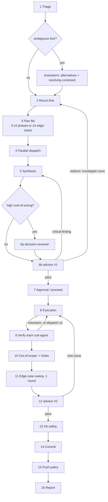

# Decision flow

Control-flow map for `task-workflow`, including every turn-back. Keep in sync with the numbered steps and the Stop-conditions table in SKILL.md.

**Turn-backs (the redirects that matter):** advisor #1 loops to Synthesis (revise the approach) or Recon (re-investigate) before any writing; Verify loops to Execution on a mismatch (cap 2); advisor #2 loops to Execution if it surfaces a new issue. Round caps for every loop are in the SKILL.md "Stop conditions" table — hitting a cap means the approach is wrong, not that one more round will close it.
